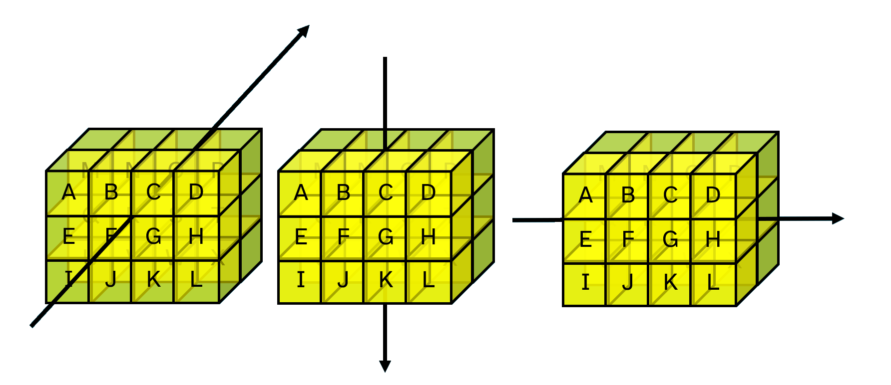

# The Array Model

## Viewing array structure
The default display forms of arrays can make it difficult to see why two arrays are different:
```APL
      1      ⍝ A simple numeric scalar
1
      ,1     ⍝ A 1-element vector
1
      1=,1   ⍝ Are their values equal? Yes
1
      1≡,1   ⍝ Are they the same? No
0
```


The `]box` [user command](./Code.md#user-commands) is a way to display arrays with extra markings which indicate the structure:

```APL
      ]box on -style=max
      'ABCD'               ⍝ A 4-element vector
┌→───┐
│ABCD│
└────┘
      1 4⍴'ABCD'           ⍝ A 1-row matrix
┌→───┐
↓ABCD│
└────┘
      1 (2 3) 4 (2 2⍴⎕A)   ⍝ A 4-element nested vector
┌→───────────────┐
│   ┌→──┐   ┌→─┐ │
│ 1 │2 3│ 4 ↓AB│ │
│   └~──┘   │CD│ │
│           └──┘ │
└∊───────────────┘
```

To see what the markings mean, see the help for the `]Display` user command:
```APL
      ]Display -??
```

## Fundamentals of high rank arrays

### Cells and axes
From the APL Wiki: 
<blockquote>
      A <a target="_blank" href="https://aplwiki.com/wiki/Cell">cell</a> is a subarray which is formed by selecting a single index along some number of leading axes and the whole of each trailing axis. Cells are classified by their rank, which may be between 0 (scalars) and the array's rank (in which case the cell must be the entire array). Cells with rank k are called k-cells of an array. A major cell is a cell whose rank is one less than the entire array, or a 0-cell of a scalar. 
</blockquote>
If the text above feels confusing, don't worry. Possibly after this chapter, and almost certainly after [the next section on selecting from arrays](../Selecting from arrays), you will be able to read it again and say to yourself "oh yeah, that makes sense". What you need to know for now is that arrays are arranged like rectangles in many dimensions. The three simplest cases should feel somewhat familiar to you.

```APL
      0            ⍝ A scalar
0
      'APL'        ⍝ A vector
APL
      0 1 2∘.*⍳5   ⍝ A matrix
0 0 0  0  0
1 1 1  1  1
2 4 8 16 32
```

Now let us look at an array with 3 dimensions. We will call it a **cuboid**:

```APL
      ⍴cuboid←2 3∘.+3 4 5∘.×4 5 6 7
2 3 4 ← trailing (last) axis
↑
leading (first) axis
```

In the array `cuboid` defined above, there are `2` **major cells**, which are those of rank `¯1+≢⍴cuboid`.

```APL
      2 3 4⍴⎕A
ABCD
EFGH
IJKL
    
MNOP
QRST
UVWX
      ≢2 3 4⍴⎕A      ⍝ Tally counts the major cells
2
```

The display may look like 2 separate matrices, but the array `2 3 4⍴⎕A` is a single, 3 dimensional array.

The dimensions of an array are also known as **axes**. The most major cells, the rank `k-1` cells for an array of rank `k`, lie along the *first* axis. The least major cells are columns which lie along the *last* axis.

In Dyalog, arrays can have up to 15 dimensions.

For more details on the APL array model in Dyalog and other array languages, see [the APL Wiki article on the array model](https://aplwiki.com/wiki/Array_model).

Now that you know how to describe the structure of an array in terms of its sub-arrays, let us look at how to apply functions to sub-arrays.

### Matching dimensions

1. Experiment with the following examples. Try to describe each one in your own words.
1. Describe how the **rank operator** `⍺(F⍤r)⍵` applies a function `F` in terms of `⍺` and `⍵`. Do not be discouraged by longer expressions and unfamiliar symbols. To help understanding, break down the expression and try pieces of it at a time. 

```APL
      names←↑'Angela' 'Pete' 'Leslie'   ⍝ A matrix of names padded with spaces
      scores←3 6 8
      'Pete  '(=⍤1 1)names
      scores[names⍳'Pete  ']
      (∧/names(=⍤1 1)'Pete  ')⌿scores
      names(∨/⍷⍤1)(⊃⌽⍴names)↑'Pete'
      mass←1 3 5 8 4
      pos←5 3⍴0 1 3 4 2
      {(+⌿⍵)÷≢⍵}mass(×⍤0 2)pos
      ×⍤0 2⍨⍳10      
```

??? Hint
	When applying dyadic functions using the rank operator, use the helper function <code class="language-APL">,⍥⊂</code> <em>ravel over enclose</em> (or <code class="language-APL">{⍺⍵}</code> for versions before Dyalog version 18.0) to see how arguments are paired up. For example:
	<pre><code class="language-APL">      names(,⍥⊂⍤1 1)'Pete  '
	      ⍉pos,⍥⊂⍤2 0⊢mass</code></pre>
	If you still feel stuck, continue reading below and return to these expressions later.

### First- and last-axis primitives

Which of the following functions are affected by the rank operator `⍤` and why are the other functions not affected?

```APL
      ⌽    ⍝ Reverse
      ⊖    ⍝ Reverse first
      +/   ⍝ Plus reduce
      +⌿   ⍝ Plus reduce-first
```

### Rank vs. Axis
We have seen two pairs of *first-* and *last-axis* primitives.

```APL
      n←2 3⍴1 2 3 1 0 ¯1
      n
1 2  3
1 0 ¯1
      +/n                ⍝ Sum along the last axis
6 0
      +⌿n                ⍝ Sum along the first axis
2 2 2
      '-'⍪2 3⍴'DYALOG'   ⍝ Catenate first
---
DYA
LOG
      '|',2 3⍴'DYALOG'   ⍝ Catenate last
|DYA
|LOG
```

Some functions and operators can be used along specified axes using the **function axis operator** `[]` (more <a target="_blank" href="https://aplwiki.com/wiki/Function-operator_overloading">duplicitous</a> symbols).

<center>
	<figure>
		
		<figcaption>
			Axes of a 3D array
		</figcaption>
	</figure>
</center>

Compare the behaviour of the monadic function `⊂` *enclose* when applied with the rank operator `⍤` versus when it is applied using **bracket axis** (another name for the *function axis operator* `[]`).

```APL
      ⊂⍤1⊢3 2 4⍴⎕A
┌────┬────┐
│ABCD│EFGH│
├────┼────┤
│IJKL│MNOP│
├────┼────┤
│QRST│UVWX│
└────┴────┘
      ⊂⍤2⊢3 2 4⍴⎕A
┌────┬────┬────┐
│ABCD│IJKL│QRST│
│EFGH│MNOP│UVWX│
└────┴────┴────┘
      ⊂⍤3⊢3 2 4⍴⎕A
┌────┐
│ABCD│
│EFGH│
│    │
│IJKL│
│MNOP│
│    │
│QRST│
│UVWX│
└────┘
```

```APL
      ⊂[1]⊢3 2 4⍴⎕A
┌───┬───┬───┬───┐
│AIQ│BJR│CKS│DLT│
├───┼───┼───┼───┤
│EMU│FNV│GOW│HPX│
└───┴───┴───┴───┘
      ⊂[2]⊢3 2 4⍴⎕A
┌──┬──┬──┬──┐
│AE│BF│CG│DH│
├──┼──┼──┼──┤
│IM│JN│KO│LP│
├──┼──┼──┼──┤
│QU│RV│SW│TX│
└──┴──┴──┴──┘
      ⊂[3]⊢3 2 4⍴⎕A
┌────┬────┐
│ABCD│EFGH│
├────┼────┤
│IJKL│MNOP│
├────┼────┤
│QRST│UVWX│
└────┴────┘
```

For a more in-depth look at the relationship between function rank and function axis, watch the Dyalog webinars on [Selecting from Arrays](https://dyalog.tv/Webinar/?v=AgYDvSF2FfU) and [The Rank Operator and Dyadic Transpose](https://dyalog.tv/Webinar/?v=zBqdeDJPPRc).

A list of functions with bracket-axis definitions can be found on [the APL Wiki page for function axis](https://aplwiki.com/wiki/Function_axis).

### Stranding
We introduced [stranding](https://aplwiki.com/wiki/Strand_notation) to show how it formed vectors before the application of dyadic functions, for example:

```APL
      2 + 2 2 + 2   
      2 + 2 (2 + 2)
      (2 + 2) 2 + 2
```

Stranding is a useful way to form arrays. Generally, arrays separated by spaces form vectors. Experiment with the examples below, and notice the difference between stranding `a b` and *catenation* `a,b`.

```APL
      2 3⍴'DY' 'AL' 'OG'
      'a' 'b' 'c'
      'a' 'bc'
      'a','b','c'
      'a','bc'
      mixed←3 3⍴1 2 3 'a' 'b' 'c'   ⍝ Simple mixed-type array
      mixed2←3 3⍴1 2 3 'abc'        ⍝ Nested mixed-type array
```

Below are some more examples to demonstrate the difference between catenation, *first-axis catenation* `⍪` and stranding. Some of these expressions will generate errors.

```APL
      tall←5 3⍴'⍟'
      long←3 5⍴'⎕'
      3 1⍴mixed tall long
      ⍪mixed tall long
      ↑mixed tall long
      mixed,long
      mixed⍪long
      mixed⍪tall
      3 3⍴mixed,long
      3 3⍴mixed tall,long
```

!!! Note
	The functions **take** `⍺↑⍵` and **mix** `↑⍵` can fill arrays with [prototypical elements](https://aplwiki.com/wiki/Prototype).  
	Try `0=↑mixed tall` and `' '=↑tall long`.

### Enclose Enlist
So **enclose** `⊂⍵` allows us to box up individual arrays into scalars. 

**Enlist** `∊⍵` removes all of the structure of an array, extracting the leaf nodes and laying them out as a single vector. 
```APL
      ∊2 3⍴1 2 'abc' 3 'def' '4'
1 2 abc 3 def4
```

Why does the `4` appear flush next to `def` when there is a space between `abc` and `3`?

### Pick and Mix
There are two more useful constructs for modifying array structures: **first** `⊃⍵` and **mix** `↑⍵`.

First is a special case of **pick** `⍺⊃⍵`, which is a way of [selecting items from nested arrays](./selecting-from-arrays.md#reach-indexing). 

Mix will increment the rank while decrementing the depth:
```APL
      {(⍴⍵)(≢⍴⍵)(≡⍵)}1 3⍴'abc' 'def''ghi'
┌───┬─┬─┐
│1 3│2│2│
└───┴─┴─┘
      {(⍴⍵)(≢⍴⍵)(≡⍵)}↑1 3⍴'abc' 'def''ghi'
┌─────┬─┬─┐
│1 3 7│3│1│
└─────┴─┴─┘
```

1. When does `(a b)≡a,b`?
1. When does `(↑a b)≡a⍪b`?

### Primitive Loops

Experiment with the following expressions to determine what the each `¨` and bind `∘` operators do in this context.

```APL
      's',¨'ong' 'ink' 'and'
      'lph',¨'ong' 'ink' 'and'
      (1 2)(2 2)(3 1)⍴¨3 4 5
      2 2∘⍴¨3 4 5
      (⍴∘3 4 5)¨2 2
```

## Problem set

1. Create the variable `nest` which has the following properties
	```APL
	      ⍴nest
	2 3
	      ≡nest
	̄2
	      ⍴ ̈nest
	┌─┬┬─┐
	│ ││2│
	├─┼┼─┤
	│3││6│
	└─┴┴─┘
	      ]display ∊nest
	┌→───────────────────┐
	│I 3 am 1 5 8 amatrix│
	└+───────────────────┘
	      ⍴∊nest
	14
	```

### Summary Statistics

1.  

	The 3D array `rain` gives the monthly rainfall in millimeters over 7 years in 5 countries.  
	<pre><code class="language-APL">      rain←?7 5 12⍴250</code></pre>
	
	For each expression below, write a brief description of the resulting statistic. If necessary, consult the hint which follows the group of expressions. 

	<pre><code class="language-APL">      (+⌿⍤1)rain      ⍝ Total rainfall for each of 7 years in each of 5 countries
	      +⌿rain
	      (+⌿⍤2)rain
	      (+⌿⍤3)rain
	      ⌈⌿rain
	      (⌈⌿⍤2)rain
	      rain[⍸rain>250]</code></pre>

	??? Hint
		Look at the shapes of the arguments and the results, <code class='language-apl'>⍴rain</code> and <code class='language-apl'>⍴+⌿rain</code> etc.

	1. Write an expression to find the average monthly rainfall for each individual month over the 7 years in each of the 5 countries.

	1. Write an expression to find the average monthly rainfall for each year for each of the 5 countries.

	1. Write an expression to find the average annual rainfall over the 7 years for each of the 5 countries.

	1. Assign scalar numeric values (single numbers) to the variables `years` `countries` `months` such that the `rain` data can be summarised as follows:
		<pre><code class="language-APL">      ⍴(+⌿⍤years)rain       ⍝ Sum over years</code></pre>
		<pre><code>5 12</code></pre>
		<hr>
		<pre><code class="language-APL">      ⍴(+⌿⍤countries)rain   ⍝ Sum over countries</code></pre>
		<pre><code>7 12</code></pre>
		<hr>
		<pre><code class="language-APL">      ⍴(+⌿⍤months)rain      ⍝ Sum over months</code></pre>
		<pre><code>7 5</code></pre>

### Rank Practice

1. Common Names for Arrays of Rank-n

	1. Match the following rank operands with their descriptions. Each use of rank (**a** to **e**) pairs with two of the 10 description boxes below.

		<pre><code class="language-APL">   a    b    c    d     e
		┌────┬────┬───┬─────┬──────┐
		│⍤1 3│⍤2 1│⍤¯1│⍤0 99│⍤99 ¯1│
		└────┴────┴───┴─────┴──────┘
		`-----------------------------------------`
		┌─┐ ┌────────────────┐ ┌────────────┐
		│⍵│ │major cells of ⍺│ │vectors of ⍺│
		└─┘ └────────────────┘ └────────────┘
		┌────────────────┐ ┌─┐ ┌──────────────┐
		│major cells of ⍵│ │⍺│ │3D arrays of ⍵│
		└────────────────┘ └─┘ └──────────────┘
		┌────────────────┐ ┌────────────┐
		│major cells of ⍵│ │scalars of ⍺│
		└────────────────┘ └────────────┘
		┌────────────────┐ ┌────────────────┐
		│matrices of ⍺   │ │vectors of ⍵    │
		└────────────────┘ └────────────────┘</code></pre>

	1. For each name below, suggest the rank for arrays with that name.

		<pre><code class="language-APL">┌────────┬────────────────────┐
		│Scalar  │                    │
		├────────┼────────────────────┤
		│Vector  │rank-1 array        │
		├────────┼────────────────────┤
		│Matrix  │                    │
		├────────┼────────────────────┤
		│Table   │                    │
		├────────┼────────────────────┤
		│List    │                    │
		├────────┼────────────────────┤
		│Cube    │                    │
		├────────┼────────────────────┤
		│4D array│                    │
		├────────┼────────────────────┤
		│2D array│                    │
		└────────┴────────────────────┘</code></pre>

1. Some Points in Space Revisited

	These problems are identical to those about Some Points in Space in [problem set 5](../Shape Reshape/#problem-set-5). This time, create a function which works on vectors and use the rank operator to solve these problems.

	The positions of 7 points in 2D space are given by the matrix `pos2`:

	<pre><code class="language-APL">      pos2←7 2⍴3 1 3 4 2 7 3</code></pre>

	1. Write a function `AddVec` to add two vectors together:
		<pre><code class="language-APL">      ¯1 1(AddVec⍤1)pos2
	2 2
	2 5
	1 8
	2 4
	0 4
	3 3
	6 4</code></pre>

	1. Write a function `NormVec` to normalise a vector so that its sum of squares is `1`.

		<pre><code class="language-APL">      +/pos2\*2</code></pre>
		<pre><code>10 25 53 18 10 20 58</code></pre>
		<hr>
		<pre><code class="language-APL">      +/((NormVec⍤1)pos2)\*2</code></pre>
		<pre><code>1 1 1 1 1 1 1</code></pre>
		<hr>
		<pre><code class="language-APL">      ÷/pos2</code></pre>
		<pre><code>3 0.75 0.2857142857 1 0.3333333333 2 2.333333333</code></pre>
		<hr>
		<pre><code class="language-APL">      ÷/(NormVec⍤1)pos   ⍝ Relative proportions stay the same</code></pre>
		<pre><code>3 0.75 0.2857142857 1 0.3333333333 2 2.333333333</code></pre>

1. Find the values of `j` and `k` in each of the two expressions below.
	1.  
	
		<pre><code class="language-APL">      0 10(×⍤j k)pos2</code></pre>
		<pre><code>0 10
		0 10
		0 40
		0 70
		0 30
		0 30
		0 20
		0 30</code></pre>

	1.  
	
		<pre><code class="language-APL">      (2×⍳7)(+⍤j k)pos2</code></pre>
		<pre><code> 5  3
		 7  8
		 8 13
		11 11
		11 13
		16 14
		21 17</code></pre>

1. Rank Matching  
	Write a function `R1` which uses catenate `,` with the rank operator `⍤` to merge a vector and matrix into a single 3D array.

	<pre><code class="language-APL">      'ABC' R1 2 3⍴⍳6</code></pre>
		<pre><code>A 1
	B 2
	C 3
	&nbsp;
	A 4
	B 5
	C 6</code></pre>

	??? Hint
		You can apply rank multiple times e.g. `f⍤j⍤k`.

1. **Split k-cells**  
	The *split* function `↓⍵` splits an array of rank ≥2 by rows, returning an array of shape `¯1↓⍴⍵`. Use *enclose* `⊂⍵` with the rank operator `⍤` to create a function `Split` which always splits an array into a nested vector of the major cells of `⍵`.

	<pre><code class="language-APL">      Split 3 2 2 3⍴⍳9
	┌─────┬─────┬─────┐
	│1 2 3│4 5 6│7 8 9│
	│4 5 6│7 8 9│1 2 3│
	│     │     │     │
	│7 8 9│1 2 3│4 5 6│
	│1 2 3│4 5 6│7 8 9│
	└─────┴─────┴─────┘</code></pre>

## Reduce on an empty vector?
For your interest, here are some reductions of note. Try to ask yourself why they give the results they do. Could they have been given different definitions?

```APL
      +/⍬
      ×/⍬
      ⌊/⍬
      ,/'APPLE' 'DOG' 'BISCUIT'
```

As mentioned previously, more detailed treatments of the rank operator can be found in the [Dyalog webinars on function rank](https://www.youtube.com/playlist?list=PLA9gQgjzcpKFW0-KldlJW6FSwHGQ1WMAJ).


1. These are the heights of some students in 3 classes. Students have numeric identifiers `id`.
	```APL
		student ← 10 7⍴'Kane   Jonah  JessicaPadma  Katie  CharlieAmil   David  Zara   Filipa '
		class ← 'CBACCCBBAB'
		height ← 167 177 171 176 178 164 177 177 173 160
	```
	1. Find the class which class has the tallest average height
		1. Find the class with the narrowest range of heights