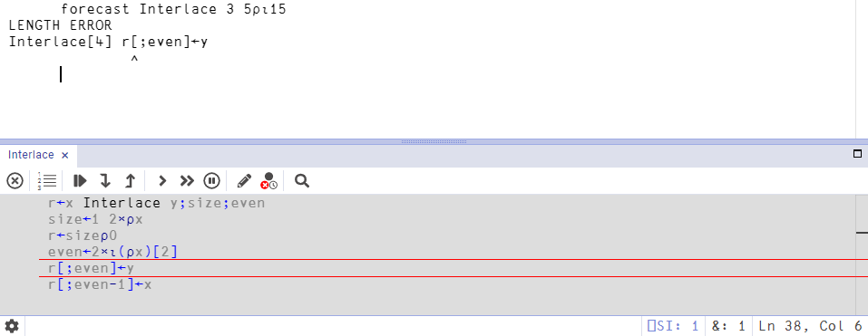

# Error Handling and Debugging
This is an abridged treatment of error handling that covers key points. You will also find useful:

- [Chapter 6 of Mastering Dyalog APL](https://mastering.dyalog.com/First-Aid-Kit.html) (Chapter E in the 2009 edition)
- [Dyalog webinars on error handling](https://www.youtube.com/watch?v=tDK0AKXXRAk&list=PLA9gQgjzcpKHi3OtHPTq7Z2LTzG6ZwMY7&index=1)
- The online documentation:
	- [Error messages](https://help.dyalog.com/latest/index.htm#Language/Errors/Error%20Messages.htm)
	- [Stop controls](https://help.dyalog.com/latest/index.htm#Language/System Functions/stop.htm)
	- [Trace controls](https://help.dyalog.com/latest/index.htm#Language/System%20Functions/trace.htm)
	- [State indicator](https://help.dyalog.com/latest/index.htm#search-state%20indicator)

## What's in a Name?

Study the following expression. It contains an error guard `::` and the primitive functions *format* `⍕` and *execute* `⍎`. 

```APL
)ns Names                                          ⍝ Create a namespace called Names      
Names.va←({2 6 11::0 ⋄ ⍎(⎕UCS ⍵),'←',⍕⍵}¨⍳1E4)~0   ⍝ Valid Assignment Character Codes      
```

1. Which three errors are trapped by the error guard? 

1. [`⎕AV`](https://aplwiki.com/wiki/Atomic_vector) is the list of characters which was used before [Unicode](https://home.unicode.org/) was introduced.
   How many valid assignment characters are in `⎕AV`?

1. When are digits `⎕D` not allowed in names?

1. Why is `9109 9054` printed to the session when the expression is run?

1. Another way to find valid naming characters is to filter `⎕AV` using `⎕NC`.

      `Names.ava←⎕AV/⍨0≤⎕NC⍪⎕AV   ⍝ ⎕AVU Valid Assignment Characters`  
      How do `Names.va` and `Names.ava` differ?

## Error Messages and Error Codes

You will have executed expressions which have resulted in some error messages by now. In fact I am certain of it because some of the previous example expressions have been deliberately written containing errors.

`LENGTH ERROR` `VALUE ERROR` `DOMAIN ERROR` `SYNTAX ERROR`

If you are trapping specific errors, you might find it useful to assign error numbers to descriptive names. For example, `(INDEX RANK LENGTH VALUE)←3 4 5 6`. There are a number of similar techniques which can be used, some of which are described in the Dyalog webinar [Error Handling - Part 1](https://www.youtube.com/watch?v=tDK0AKXXRAk&list=PLA9gQgjzcpKHi3OtHPTq7Z2LTzG6ZwMY7&index=4&t=844s).

1. Find the error codes of the four error messages given above.

	??? Hint
		Try:
		<pre><code class="language-APL">      1 2+2 3⍴⍳9   ⍝ Write some expression to generate the error
		      ⎕←⎕EN        ⍝ Inspect the Error Number of the last error
		      ⎕←⎕EM 4      ⍝ Inspect the Error Message for that number</code></pre>
		
		You can also search [using APLcart](https://aplcart.info/?q=%3A%3ADOMAIN#)

1. Write a function `ERROR` which returns error numbers for in-built messages, given a simple character vector or nested vector of character vectors as argument.
	<pre><code class="language-APL">      ERROR 'RANK'
4
      ERROR 'LENGTH' 'DOMAIN'
5 11</code></pre>

!!! Note
	Technically, `⎕EM` and `⎕EN` are **event message** and **event number** respectively. Most of the time you will be concerned about error events, but other types of events exist as well.

## Suspend your disbelief
When an error occurs in a [multi-line function](../Ufns), the interpreter will pause execution and show the tracer.

```APL
     ∇ r←x Interlace y
[1]    size←1 2×⍴x    
[2]    even←2×⍳(⍴x)[2]
[3]    r[;even]←y     
[4]    r[;even]-1←x   
     ∇   
```
---
```APL
      ⎕RL ← 73
      ⎕←forecast ← 10×?4 6⍴55
```

<center>
	<figure>
		
		<figcaption>
			Fig 6.4 from Mastering Dyalog APL: Trace window in the RIDE
		</figcaption>
	</figure>
</center>

The state of your program is frozen in time. You can now:

- Inspect the values of variables
- Use `)SI`, `⎕SI` or `⎕XSI` to get a list of currently suspended functions
- Inspect or use the value of `⎕DM` `⎕DMX` to pass information about the error
- Edit the function to fix the issue
	- Either **double click blank space** or use <kbd>Shift+Enter</kbd> while the text cursor is on a blank space to turn the tracer into an editor
	- Edit the code to fix the issue
	- Press <kbd>Esc</kbd> or **click the cross button ⮾** to save these changes and return to the tracer
	- Continue execution by either:
		- Press <kbd>Enter</kbd> to proceed one line at a time
		- Click the [trace action](https://mastering.dyalog.com/First-Aid-Kit.html#trace-actions) button to continue execution normally
		- Type `→⎕LC` (*go-to quad LC*) to continue execution normally

Sometimes it is better to execute a function line-by-line rather than wait for an error to occur. To do this, with the text cursor on the function-calling expression, either press <kbd>Ctrl+Enter</kbd> or click **Action → Trace** from the IDE menu.

Executing, stepping into or editing a function with <kbd>Enter</kbd>, <kbd>Ctrl+Enter</kbd> and <kbd>Shift+Enter</kbd> can all be done while tracing through a suspended function.

## Can't be helped
If you cannot fix the error immediately and would just like to return to the session, use one of:

- Press <kbd>Esc</kbd> to exit the current function
- Enter `→0` into the session to exit the current function and resume the calling line
- Type `→` (naked branch) into the session to clear the last call on the stack
- Enter `)RESET` or `)SIC` into the session to clear the entire execution stack and return to the session

## Gotta :Trap 'em all
The keyword `:Trap ErrorNums` allows a function to specify behaviour if an error with a number in the scalar or vector `ErrorNums` occurs. It can be used in conjunction with `:Case N` to execute some code if the error number is `N` and `:Else` for the other errors. All errors are trapped with `:Trap 0`.

For example:

```APL
 :Trap 3 4 5 6 11
    ⍝ Code to execute here
 :Case 3
     ⎕←'Index Error'
 :CaseList 5 6 11
     ⎕←'Length, Value or Domain Error'
 :Else
     ⎕←'Rank Error'
 :EndTrap
```

## ⎕TRAP
Before `:Trap` and other similar control structures were introduced, `⎕TRAP` was the way to set error trapping behaviour. Nowadays, most people will use control structures for visual clarity in their new code. However, `⎕TRAP` is still used to maintain style in existing code bases, and for certain behaviours that are not possible with `:Trap`.

For example, we can alter the behaviour when an error occurs in the session:  
```APL
      ⎕trap←5 'E' '''Silly!'''
      1 2 + 3 4 5
```
```
Silly!
```

!!! Note
	Some errors, such as `SYSTEM ERROR`, are not trappable.

Not only does the trap execute custom code when a `LENGTH ERROR` occurs, but it also prevents the tracer from automatically opening when such an error occurs in a function.

```APL

     ∇ r←l Lerror r
[1]    l+r         
     ∇             

      1 2 Lerror 3 4 5
```
```
Silly!
```

However, those function calls are still suspended as can be seen using the state indicator:

```APL
      1 2 Lerror 3 4 5
```
```
Silly!
```
---
```APL
      )si
```
```
#.Lerror[1]*
#.Lerror[1]*
```

The 2nd element of an item in `⎕TRAP` determines what happens to the call stack (this cannot be achieved with `:Trap`):

**E**: execute expression named in the 3rd element

**C**: cut back the stack to where `⎕TRAP` is localised and then execute expression named in the 3rd element

```APL
      ⎕TRAP←11 'C' '(↑⎕DM)'
      Foo
```
```
DOMAIN ERROR
Foo[1] 1÷0  
        ∧   
```
---
```APL
      0∊⍴⎕SI
```
```
1
```

**N**: next - skip this error (no 3rd element)

This is only meaningful if there is a trap 0 higher up the stack. It can be used for trapping every error except a specific one:

```APL
     ∇ Trap6 x;⎕TRAP                   
[1]   ⍝ Handle all but value errors    
[2]    ⎕TRAP←(6 'N')(0 'E' '→ERROR')   
[3]    ⍎x ⍝ x contains a program to run
[4]    →0                              
[5]   ERROR:'Uh oh!'                   
     ∇    
```

**S**: stop - normal error handling (no 3rd element)

This is typically used with a debugging switch:

```APL
⎕TRAP←(1+DEBUG)⊃(0 'E' 'Bad')(0 'S')
```

!!! Warning
	The **E** (execute immediately) action code is very tricky to use and best avoided. Prefer to use **C**, or even better, a `:Trap` control structure.

Reset error trapping to default behaviour:  

```APL
      ⎕TRAP⍴⍨←0
```

In general, you assign a nested vector of 3-element vectors to `⎕TRAP`, each of the form `(numbers 'X' 'string')`.

## Who needs to know?
Errors can occur due to a mistakenly written piece of code. However, even a perfectly valid function can trigger errors if run with input which is outside of its domain.

!!! Note
	It is best not to rely on error trapping for behaviour, in part because future extensions to the language may introduce valid behaviours in those cases.

You should test inputs explicitly using APL primitives. It can be tempting to use `:Trap 0` to force alternative behaviour for unexpected inputs. However, trapping all errors should only really be done in order for your application to fail safely for the sake of end users. Best practice is to think carefully about the properties of valid inputs to your functions, and signal errors or otherwise indicate to the user that an invalid input has been attempted.

## Pass it on
`⎕DMX` is a system object containing information about the last occuring error. Recent versions of Dyalog can display its contents in a human-readable JSON format:

```APL
      (⎕JSON⍠'Compact' 0)⎕DMX   
```

!!! Note
	Your code should not assume that the properties in `⎕DMX` will stay the same across versions of Dyalog. See [the online documentation](https://help.dyalog.com/latest/index.htm#Language/System%20Functions/dmx.htm) for more information about `⎕DMX`.

The system function `⎕SIGNAL` can be used to generate errors. Errors may be signalled without a guilty expression, or custom error codes and messages may be signalled.

Monadic `⎕SIGNAL` can be used to provide custom values for `⎕DMX`.

```APL
      ⎕SIGNAL⊂('EN' 666)('Message' 'The Devil''s Error')('Vendor' 'Satan')
```

Dyadic `⎕SIGNAL` can be used to conveniently set the event message and event number. Slightly confusingly, the `⎕EM` event message is different from the error message member of the **D**iagnostic **M**essage **Extended**: `⎕DMX.Message` .

```APL
      'Yo!'⎕SIGNAL 42
      ⎕EM
      ⎕DMX.Message
```

Error signalling can be used to provide custom error messages, as well as to prevent the application from suspending in the tracer, which can be confusing for end users of your application who do not know APL. You might prefer that user-facing functions trap and re-signal errors, whereas utilities intended for use by APLers in the session might be left to suspend on error.

## Error number ranges
Event numbers 1-99 are generated by APL.

Event numbers 1-999 can be generated by the user.

Error 0 means "any error".

Errors 1001-1008 are interrupts (e.g. break).

Error 1000 means "any interrupt".

## ⎕TRACE
Specify line numbers within a function or operator to have the results of expressions on those lines output to the session when executed.

Attempts to set trace controls in a locked function or operator (see `⎕LOCK`) are ignored.

## The stack
**The execution stack** (sometimes referred to as just **the stack**) is the accumulation of functions either suspended or currently mid-execution. It can be inspected using `)SI`, `⎕SI` and `⎕XSI`. If you attempt to run or re-run functions without having cleared the stack, then the stack simply builds up until the workspace is full.

```text
      ⎕VR'Foo'
     ∇ Foo
[1]    1÷0
     ∇    

      Foo
DOMAIN ERROR: Divide by zero
Foo[1] 1÷0
        ∧

      Foo
DOMAIN ERROR: Divide by zero
Foo[1] 1÷0
        ∧

      )SI
#.Foo[1]*
#.Foo[1]*
```

There are a number of system variables to deal with functions on the stack:

<table>
	<tr>
		<td><code>⎕SI</code></td><td>The names of functions on the stack</td>
	</tr>
	<tr>
		<td><code>⎕LC</code></td><td>The line numbers at which each function is suspended</td>
	</tr>
	<tr>
		<td><code>⎕NSI</code></td><td>The namespaces prior to the call as character vectors</td>
	</tr>
	<tr>
		<td><code>⎕RSI</code></td><td>The namespaces prior to the call as scalar references</td>
	</tr>
	<tr>
		<td><code>⎕XSI</code></td><td>The full namespace paths of functions on the stack</td>
	</tr>
	<tr>
		<td><code>⎕STACK</code></td><td>The stack of functions and state descriptions</td>
	</tr>
</table>

To get the same diagnostic error messages printed to the session without building up the stack, you can set `⎕TRAP` to use a custom error reporting function:

```APL
     ∇ Error                                                                             
[1]    ⎕DMX.(OSError{⍵,2⌽(×≢⊃⍬⍴2⌽⍺,⊂'')/'") ("',⊃⍬⍴2⌽⊆⍺}Message{⍵,⍺,⍨': '/⍨×≢⍺}⊃⍬⍴DM,⊂'')
[2]    ↑1↓⎕DMX.DM                                                                        
     ∇  
```
---
```APL
      ⎕TRAP←0 'C' '#.Error'
      Foo
```
```
DOMAIN ERROR: Divide by zero
Foo[1] 1÷0
        ∧ 
```
---
```APL
      )SI
      
```

The long, awkward expression in `Error` above can be found [in APLcart](https://aplcart.info/?q=print%20error%20message#).

## Problem set 12

### Help I'm Trapped
Here we will write a simple calculator program to divide two vector arguments. When the function fails it should return to the session and leave the stack empty, but the values of `⎕DM` and `⎕EN` should change.

1. Write a program (a tradfn called `Divide`) which explicitly tests its input and signals an appropriate error for invalid arguments. 

1. Rewrite the program as a tradfn called `DivideQ` which uses `⎕TRAP` instead of testing its arguments.

1. Rewrite the program as a tradfn called `DivideC` which uses `:Trap`.

1. Rewrite the program as a dfn `DivideD` with error guards.

Example output:

```APL
      1 2 3 Divide ,5
0.2 0.4 0.6
      3 Divide ,4
RANK ERROR: Must have both vector arguments
      3 Divide,4
        ∧
      1 2 Divide 1 2 3 
LENGTH ERROR: Mismatched left and right argument shapes
      1 2 Divide 1 2 3
          ∧
      1 2 Divide 1 0
DOMAIN ERROR: Divide by zero
      1 2 Divide 1 0
          ∧      
```

### Prefix agreement operator
[**Leading axis agreement**](https://aplwiki.com/wiki/Leading_axis_agreement) is a proposed extension to scalar extension which will automatically apply dyadic functions between cells when the leading axes of two arrays match.

```APL
      2 3 ×_L 2 3⍴⍳6
 2  4  6
12 15 18
```

If the leading axis lengths do not match at all, then the operator will issue an error. Write a version of the prefix agreement operator `_L` which manually checks whether the argument shapes have a matching prefix, and signals a custom error otherwise.

```APL
      2 3×_L 1 3⍴⍳6
LEADING AXIS MISMATCH
      2 3×_L 1 3⍴⍳6
         ∧
      ⎕EN
5
```

??? Hint
	If you are not sure how to write the functionality of the leading axis operator, use the definition from the APL Wiki article:
	
	<pre><code class="language-APL">{⍺ ⍺⍺⍤(-⍺⌊⍥(≢⍴)⍵)⊢⍵}</code></pre>

### Testing for types
Use the documentation and your own knowledge to find expressions to test for the following properties of arrays:

1. Numeric arrays
1. Character arrays
1. Integers
1. Simple arrays (non-nested)
1. Uniformly nested arrays
1. Scalars, vectors and matrices
1. Singleton values
1. Namespace references
1. Namespace names as character arrays
1. [Symmetric matrices](https://en.wikipedia.org/wiki/Symmetric_matrix)


1.  
	
	In general, you assign a nested vector of 3-element vectors to `⎕TRAP`, each of the form `(numbers 'X' 'string')`. 
	
	In terms of its structure, what happens to the value of `⎕TRAP` if you only assign a single 3-element vector?

### Can you fix it?
This scripted namespace defines a toy app to read a UTF-8 text file and convert its data to hexadecimal representation.

```APL
:Namespace app

    file←'/tmp/file.txt'

    ∇ Main
      Hex file
    ∇

    ∇ hex←Hex file;bytes;⎕TRAP
      bytes←'UTF-8'∘⎕UCS¨⊃⎕NGET file 1
      hex←↑{,⍉3↑(⎕D,⎕A)[16 16⊤⍵]}¨bytes
    ∇

:EndNamespace
```

The author of the function modifies it to exhibit certain error handling behaviours. Unfortunately, their code has bugs. Investigate the following scenarios and try to solve the issues.

1.  
	
	The author has set up error trapping. They are aware of a potential `FILE NAME ERROR`, but have also set up a global trap in case any unexpected errors occur.
	
	    :Namespace app
	    
	        file←'/tmp/file.txt'
	    
	        ∇ Main;⎕TRAP
	          ⎕TRAP←0 'E' 'Report ⋄ →0'
	          Hex file
	        ∇
	    
	        ∇ hex←Hex file;bytes
	          ⎕TRAP←22 'C' '→ERROR'
	          bytes←'UTF-8'∘⎕UCS¨⊃⎕NGET file 1
	          hex←↑{,⍉3↑(⎕D,⎕A)[16 16⊤⍵]}¨bytes
	          →0
	          
	         ERROR:
	          Report
	        ∇
	    
	        ∇ Report
	          error←↑⎕DM
	          ⎕←'An error occurred. See app.error for more information.'
	        ∇
	    
	    :EndNamespace
	
	Unfortunately, the function suspends with an unexpected `VALUE ERROR`.
		
	    VALUE ERROR: Undefined name: ERROR
	          →ERROR
	           ∧
	
	After modifying the code, the function should print to the session:
	
	          app.Main
	    An error occurred. See app.error for more information.
	
	The variable `app.error` should be populated:
	
	          ⎕←app.error
	    FILE NAME ERROR                        
	    Hex[2] bytes←'UTF-8'∘⎕UCS¨⊃⎕NGET file 1
	                               ∧           
	

1.  
	
	Now that the file name error is handled, they want to test the application using a file. Paste the following into a text editor and save it somewhere. Update `app.file` to point to the correct location.
	
	    sample text
	
	Running `app.Main` reveals either 1 or 2 more bugs:
	
	- Running the function now results in an `INDEX ERROR`.
	- The global trap did not catch the `INDEX ERROR`.
	
	Fix the remaining bugs. The application should successfully convert the file now:
	
	          app.Main
	    73 61 6D 70 6C 65 20 74 65 78 74 
	

1.  
	
	Finally, the author decides it would be more useful if `app.error` contained more information about the error, and also that the `Report` function should display this directly in the session as well.
	
	    :Namespace app
	    
	        file←'/tmp/file.txt'
	    
	        ∇ Main;⎕TRAP
	          ⎕TRAP←0 'E' 'Report {⍵(⍎⍵)}¨⎕NL¯2 ⋄ →0'
	          Hex file
	        ∇
	    
	        ∇ hex←Hex file;bytes
	          ⎕TRAP←22 'C' '→ERROR'
	          bytes←'UTF-8'∘⎕UCS¨⊃⎕NGET file 1
	          hex←↑{,⍉3↑(⎕D,⎕A)[16 16⊤⍵]}¨bytes
	          →0
	          
	         ERROR:
	          Report⊂'file' file
	        ∇
	    
	        ∇ Report names_values
	          error←⊂↑⎕DM
	          error,←⊂↑names_values
	          ⎕←'An error occurred. Error information in app.error:'
	          ⎕←error
	        ∇
	    
	    :EndNamespace
	
	1. Turn `]box -fns=on`
	1. Reinstate the `FILE NAME ERROR` and run `app.Main` again.
		
		          app.Main
		    An error occurred. Error information in app.error:
		    ┌───────────────────────────────────────┬────────────────────┐
		    │FILE NAME ERROR                        │┌────┬─────────────┐│
		    │Hex[2] bytes←'UTF-8'∘⎕UCS¨⊃⎕NGET file 1││file│/tmp/file.txt││
		    │                           ∧           │└────┴─────────────┘│
		    └───────────────────────────────────────┴────────────────────┘
	
	1. Reinstate the `INDEX ERROR` and run `app.Main` again at least twice. 
		1. What do you notice about `app.error`?
		1. Try to solve this issue. There is more than one valid solution.
