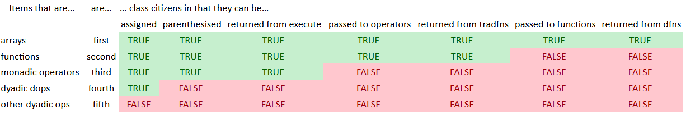

# Interpreter Internals
Just some of the nitty-gritty under the covers.

## Storage
Memory allocated to store an array needs space for:

- Each element of the array (which could be a reference to another array)
- `8×≢⍴array` bytes for the shape (`4×` in 32-bit)
- 4 bytes for the type/rank

For a reference, the object requires an 8-byte pointer, plus space for the contents of the object.

## Data types
Internally, Dyalog represents data with the following types. As a program runs, occasionally the interpreter will squeeze arrays into the smallest data type that can represent a particular figure, which helps keep memory usage low and may allow the interpreter to use vectorised instructions for certain operations on certain data types.

!!! Warning "Version Warning"
	Some data types are only available in Dyalog Unicode Edition.

### Character
```
      ⎕DR'APL'           ⍝ 1-byte
80
      ⎕DR'配列'           ⍝ 2-byte
160
      ⎕DR⎕←⎕UCS 128077   ⍝ 4-byte
👍
320
```

### Number
```
      ⎕DR 1 0 1 0 1 0   ⍝ 1 bit
11
      ⎕DR 42            ⍝ 1 byte
83
      ⎕DR 128           ⍝ 2 byte
163
      ⎕DR 2*15          ⍝ 4 byte
323
      ⎕DR 0J1           ⍝ Complex (2×8 byte double)
1289
```

#### Floating-point representation
There are also 16-byte decimal floating point numbers available, but you need to enable them with `⎕FR`.

```
      ⎕PP←34
      ○1
3.141592653589793
      ⎕FR←645    ⍝ 64-bit float (default)
      ○1
3.141592653589793
      ⎕FR←1287   ⍝ 128-bit decimal
      ○1
3.141592653589793238462643383279503
```

#### Comparison tolerance
APL systems prefer to act like traditional arithmetic where possible. However, the base-2 (binary) representation used by computers is unable to represent certain decimal numbers precisely. Therefore, floating point arithmetic voids certain mathematical properties:

${{1}\over{3}} = 3 \times {{5}\over{9}} \div 5$

```APL
      ⎕CT←1e¯14   ⍝ Default comparison tolerance
      (1÷3)=3×(5÷9)÷5
```
```
1
```
---
```APL
      ⎕CT←0       ⍝ No comparison tolerance
      (1÷3)=3×(5÷9)÷5
```
```
0
```
---
```APL
      ⎕FR←645 ⋄ ⎕CT←1E¯14
      {↑⍵(1=1+10*-⍵)}⍳16
```
```
1 2 3 4 5 6 7 8 9 10 11 12 13 14 15 16
0 0 0 0 0 0 0 0 0  0  0  0  0  1  1  1
```
---
```APL
      ⎕FR←1287 ⋄ ⎕←⎕DCT
```
```
1E¯28
```
---
```APL
      {↑⍵(1=1+10*-⍵)}⍳30
```
```
1 2 3 4 5 6 7 8 9 10 11 12 13 14 15 16 17 18 19 20 21 22 23 24 25 26 27 28 29 30
0 0 0 0 0 0 0 0 0  0  0  0  0  0  0  0  0  0  0  0  0  0  0  0  0  0  0  1  1  1
```

For exact comparisons set `⎕CT` to `0`, but beware:

```APL
      10=+/100⍴0.1
```
```
1
```
---
```APL
      ⎕CT←0
      10=+/100⍴0.1
```
```
0
```
---
```APL
      10-+/100⍴0.1
```
```
1.953992523E¯14
```

### Value types
If more than one name points to the same array value:
```
      a←b←1 2 3 4
```
then there is a reference count internally, and only one copy of the data is stored in memory.

If one of those arrays is modified:
```
      b[2]←99
```
then a copy of the data is taken at that point so that other arrays are unaffected:
```
      a b
┌───────┬────────┐
│1 2 3 4│1 99 3 4│
└───────┴────────┘
```

For a nested array, however, the elements are separate.
```
      a←b←(1 2 3)(4 5)
```
if one of the elements is modified
```
      b[⊂2 1]←99
```
then the other elements remain shared between names. In this example, the `1 2 3` array remains shared.

### Reference types
While APL arrays are pass-by-value, namespaces and other objects are pass-by-reference.

```
      nsref←⎕NS⍬
      jsonref←⎕JSON'{}'
      ⎕FIX':Class myclass' ':Endclass'
      ⎕DR¨nsref jsonref myclass
326 326 326
```

Although namespaces are pass-by-reference, the references themselves are still values:
```
      (ns1 ns2)←⎕NS¨2⍴⊂⍬
      (ns1 ns2).var←42 99
      a←ns1
      a.var
42
      a←ns2
      a.var
99
```

## APL item hierarchy
This useful chart shows what operations are valid for different kinds of items.



## Configuration parameters
Many aspects of the interpreter environment can be modified before runtime using [**configuration parameters**](https://help.dyalog.com/latest/index.htm#UserGuide/Installation%20and%20Configuration/Configuration%20Parameters.htm). The values of configuration parameters are determined by a hierarchy of scope on the operating system. On Microsoft Windows, these are often registry settings at the base level. On Unix-like systems, they are environment variables.

For example, we can set parameters on the command line in a batch file before starting Dyalog. We can even create custom parameters.

*Save the following as a .bat file and run it on Windows*

```text
@SET FOO=bar
@START "Dyalog" "C:\Program Files\Dyalog\Dyalog APL-64 18.0 Unicode\dyalog.exe"
```

See the value of a configuration parameter with `⎕NQ`:

```APL
      ⎕←2⎕NQ'.' 'GetEnvironment' 'FOO'
```
```
bar
```

You might find it useful to read the [Dyalog for Microsoft Windows Installation and Configuration Guide](http://docs.dyalog.com/17.1/Dyalog%20for%20Microsoft%20Windows%20Installation%20and%20Configuration%20Guide.pdf#%5B%7B%22num%22%3A22%2C%22gen%22%3A0%7D%2C%7B%22name%22%3A%22XYZ%22%7D%2C63%2C679.5%2C0%5D) and the [Dyalog for UNIX Installation and Configuration Guide](http://docs.dyalog.com/17.1/Dyalog%20for%20UNIX%20Installation%20and%20Configuration%20Guide.pdf#%5B%7B%22num%22%3A21%2C%22gen%22%3A0%7D%2C%7B%22name%22%3A%22XYZ%22%7D%2C63%2C541.5%2C0%5D).

Recent versions of Dyalog support universal [configuration files](https://help.dyalog.com/latest/index.htm#UserGuide/Installation%20and%20Configuration/Configuration%20Files.htm) which work across all supported platforms.

## What am I running?
Here are some useful code snippets for finding information about the currently running interpreter:

What version of Dyalog am I running?

```APL
'#'⎕WG'APLVersion'   ⍝ '#' is '.' in older versions of Dyalog
```

For error reports, get the BuildID:

```APL
⎕←2⎕NQ'#' 'GetBuildID'
```

Am I a Unicode interpreter?

```APL
80=⎕DR''
```

Am I big endian?

```APL
⍬⍴83 ⎕DR 256
```

What is my word width?

```APL
32×1+'4'∊⊃#⎕WG'APLVersion'   ⍝ 64-bit has 64 in the platform name. Otherwise the interpreter is 32-bit.
```

## Performance
This course is intended to teach not only the symbols, syntax and system interactions of Dyalog APL, but also to try and teach you *the APL way*. This is a combination of array-oriented problem solving and ability to combine primitives to solve all manner of problems using computers.

There are some inherent benefits to APL, such as the fact that exploring with APL can often lead you to optimal solutions to particular types of problems. Not only this, but the terseness makes it very easy to experiment and play with different approaches to the same problem.

Besides APL itself, however, there are particular techniques, considerations, and special optimisations within the Dyalog interpreter that you should be aware of in case you find a performance bottleneck in your application and are wondering how to solve it.

### Flat array techniques
Nested arrays are a very convenient construct and can be used to write incredibly elegant expressions for certain operations. For example:

```APL
      ≢¨⊆⍨1 1 1 0 1 1 1 1 0 1 1 0 1 1 1 1 0 1 1 1 1
3 4 2 4 4
```

However, for long arguments this statement involves allocating many potentially disparate regions of memory and chasing pointers. Try to think of an approach which uses only flat arrays.

??? Example "Answer"
	One solution [from APLcart](https://aplcart.info/?q=lengths%20of%20groups%20of%201s#):
	
	<pre><code class="language-APL">(0~⍨¯1-2-/∘⍸1,1,⍨~)</code></pre>
	
	Of course, for certain arguments simply having more functions can be a performance penalty. Compare `]runtime` of the two expressions with `short←1=?10⍴2` and `long←1=?1e6⍴2`

#### Peppery code
One of the [**code smells**](https://en.wikipedia.org/wiki/Code_smell) in APL is large amounts of code to achieve something relatively simple. This is usually (but not always!) an indication that the problem can be thought of in a different way to achieve a more elegant and efficient solution.

Another code smell is when a solution is littered with the each operator `F¨` . These are explicit looping operations and often suggest that the code can be re-written to take advantage of the implicit iteration and potential parallelisation of the core primitives acting on flat arrays.

```APL
      arg←?5 3⍴10
      
      ]runtime -c "{⌊0.5+(+⌿÷≢)⍉⍵}arg" "{⌊0.5+(+/⍵)÷⊃⌽⍴⍵}arg" "{⌊0.5+¨(+/¨s)÷c←≢¨s←↓⍵}arg"
```
```
                                                                                      
  {⌊0.5+(+⌿÷≢)⍉⍵}arg         → 1.1E¯6 |   0% ⎕⎕⎕⎕⎕⎕⎕⎕⎕⎕⎕⎕⎕⎕⎕⎕⎕⎕⎕⎕⎕⎕⎕⎕⎕                
  {⌊0.5+(+/⍵)÷⊃⌽⍴⍵}arg       → 8.6E¯7 | -25% ⎕⎕⎕⎕⎕⎕⎕⎕⎕⎕⎕⎕⎕⎕⎕⎕⎕⎕⎕                      
  {⌊0.5+¨(+/¨s)÷c←≢¨s←↓⍵}arg → 1.8E¯6 | +60% ⎕⎕⎕⎕⎕⎕⎕⎕⎕⎕⎕⎕⎕⎕⎕⎕⎕⎕⎕⎕⎕⎕⎕⎕⎕⎕⎕⎕⎕⎕⎕⎕⎕⎕⎕⎕⎕⎕⎕⎕ 
```

### Loop sometimes
Some types of algorithms really aren't amenable to parallelisation and array-oriented techniques. These are usually problems with heavy dependence on intermediate results. Sometimes they can be encoded in a custom scan or reduction, but the overall algorithm isn't able to take advantage of parallelisation that primitive scans and reductions can.

Another consideration is that sometimes an elegant-looking solution in APL is quite inefficient. Take the prime number filter we saw early on:

<pre><code class="language-APL">Primes ← {⍸2=+⌿0=∘.|⍨⍳⍵}</code></pre>

An alternative coding uses the multiplication table:

<pre><code class="language-APL">Primes ← {i~∘.×⍨i←1↓⍳⍵}</code></pre>

Of course, the outer product `∘.F` indicates that the number of calculations to compute both of these solutions increases with the square of the input size. We say they have a computational complexity "*of order n squared*" or $O(n^2)$ in [big-O notation](https://en.wikipedia.org/wiki/Big_O_notation). This is a very inefficient way to find prime numbers.

To see discussions around more efficient ways to compute prime numbers in APL, see [the dfns page on prime numbers](https://dfns.dyalog.com/n_pco.htm).

Put simply, the fastest algorithm in general is the one which performs the fewest computations. Sometimes there are solutions in APL which use a relatively large amount of memory but are fast in time due to optimised primitives. However, sometimes the domain of the problem grows so large that even these solutions are outperformed by a scalar looping solution. When this is the case, if performance is very important for this part of your application, it can be a good idea to search for pre-existing high performance solutions, or to write the solution in a lower level language, and use `⎕NA` to integrate it with your APL code.

1. Try to find an optimised expression which uses the rank operator `F⍤k`.
1. What is the computational complexity of a custom reduction `F/⍵`?
1. What is the computational complexity of a custom scan?
1. How do custom scans and reductions compare with primitive scans and reductions for `+ - × ÷`?

### Idioms
APL idioms are short expressions to perform certain tasks. [APLcart](https://aplcart.info) is a comprehensive, searchable list of idioms. Some of these include slightly obscure but performant versions of particular tasks, especially those related to [partitioned functions](https://aplcart.info/?q=partitioned#).

In Dyalog APL, there are also "idioms" which are specially recognised phrases, or combinations of characters, which are treated as individual tokens and executed with special code, rather than parsed symbol-by-symbol and executed function-at-a-time. These offer significant performance improvements for particular tasks, and are all listed:

- [latest](https://docs.dyalog.com/latest/CheatSheet%20-%20Idioms.pdf)
- [17.1](https://docs.dyalog.com/17.1/CheatSheet%20-%20Idioms.pdf)
- [12.1](https://help.dyalog.com/12.1/index.html?page=html%2Fidiom%20list.htm)

### Philosophical tangent
In an ideal world, programmers could focus on writing purely the "most readable" or "most maintainable" versions of their code. Or, in some sense, simply write "whatever feels right" and the interpreter or compiler could analyse the program and determine the optimal. This is part of what compilers hope to achieve. However, even in one the strongest attempts at this so far, Julia, they emphasise that you still need to learn to write "idiomatic Julia" code. This means understanding how the language works both in terms of semantics and which constructs can be written in a particular way to lead to high performance.

In Dyalog APL, one example of this is in the primitive operators.

The key operator `F⌸` applies its operand function `F` to grouped major cells of its argument array. An alternative approach is to have a function `{⊂⍵}⌸` perform the grouping first and then to apply using each `F¨{⊂⍵}⌸` . The end result of the computation is the same, but by having an operator, the interpreter implementors can use especially efficient special code for certain operand functions.
