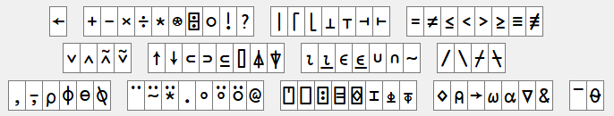

<div align="center">
<iframe width="560" height="315" src="https://www.youtube.com/embed/m2krbWBd1WU" frameborder="0" allow="accelerometer; autoplay; encrypted-media; gyroscope; picture-in-picture" allowfullscreen></iframe>
</div>

### Creating a Matrix
The "outer product" `∘.F` operator applies its function operand `F` between all combinations of elements of its left and right argument arrays. 

```APL
      F←{⍺+⍵}
      1 2 3 ∘.F 10 20 30
11 21 31
12 22 32
13 23 33
```

For example, the catenate function `⍺,⍵` (comma) will join two lists together. We can use the outer product to join combinations of words from two lists. 

```APL
      1 4 9 , 6 5 4
1 4 9 6 5 4
      'joined up' , 'text vectors'
joined uptext vectors

      'chicken' 'pork' 'vegetable' ∘., ' chow mein' ' with cashew nuts'
┌───────────────────┬──────────────────────────┐
│chicken chow mein  │chicken with cashew nuts  │
├───────────────────┼──────────────────────────┤
│pork chow mein     │pork with cashew nuts     │
├───────────────────┼──────────────────────────┤
│vegetable chow mein│vegetable with cashew nuts│
└───────────────────┴──────────────────────────┘
```

!!! Note
	If you do not see lines around the output of the last expression above in your interpreter session, turn boxing on:
	<pre class='language-APL'>      ]box on
	Was OFF
	      ⍳3 3
	┌───┬───┬───┐
	│1 1│1 2│1 3│
	├───┼───┼───┤
	│2 1│2 2│2 3│
	├───┼───┼───┤
	│3 1│3 2│3 3│
	└───┴───┴───┘</pre>

### Reduce down     

Reduce-first `F⌿` on a matrix will reduce down columns instead of along rows. 

```APL
			∘.÷⍨⍳3
```
```
1 0.5 0.3333333333
2 1   0.6666666667
3 1.5 1
```
---
```APL
			+/∘.÷⍨⍳3               ⍝ Sum of rows
```
```
1.833333333 3.666666667 5.5
```
---
```APL
			+⌿∘.÷⍨⍳3               ⍝ Sum of columns
```
```
6 3 2
```

### Comparison Functions

Up to now the only comparison function we have seen is `⍺=⍵`. You should be aware that APL includes logical comparison functions `< ≤ = ≠ ≥ >`.

Furthermore, most necessary [primitives](https://aplwiki.com/wiki/Glyph) have been explicitly introduced before each problem set. Many APL interpreters include a *language bar* to aid with typing symbols. Necessary constructs will continue to be introduced in each section. However, you are encouraged to explore the language bar and experiment with the primitive functions, as these constitute your core vocabulary for solving problems.

<div align="center">

</div>

As you continue through these sessions fewer outright explanations will be given, and you are encouraged to experiment with the given examples to develop an understanding of the language.

It is also worth mentioning at this point that pressing `F1` in Dyalog with the text cursor on a primitive will open the help for that primitive.

## Problem Set 4

1. Back to School
	1. Write a function to produce the multiplication table from `1` to `⍵`. 

		<pre><code class="language-APL">      MulTable 7</code></pre>
		<pre><code class="language-APL">1  2  3  4  5  6  7
		2  4  6  8 10 12 14
		3  6  9 12 15 18 21
		4  8 12 16 20 24 28
		5 10 15 20 25 30 35
		6 12 18 24 30 36 42
		7 14 21 28 35 42 49</code></pre>

	1. Write a function to produce the addition table from `0` to `⍵`.

		<pre><code class="language-APL">      AddTable 6</code></pre>
		<pre><code class="language-APL">0 1 2 3  4  5  6
		1 2 3 4  5  6  7
		2 3 4 5  6  7  8
		3 4 5 6  7  8  9
		4 5 6 7  8  9 10
		5 6 7 8  9 10 11
		6 7 8 9 10 11 12</code></pre>

	??? Example "Answers"
		<ol type="a">
			<li><pre><code class="language-APL">MulTable ← {(⍳⍵)∘.×⍳⍵}</code></pre>
			which can be simplified using the *selfie* operator `⍨`
			<pre><code class="language-APL">MulTable ← {∘.×⍨⍳⍵}</code></pre></li>
			<li><pre><code class="language-APL">AddTable ← {∘.+⍨¯1+⍳⍵}</code></pre></li>
		</ol>

1. Making the Grade

    |   |   |   |   |   |   |
    |---|---|---|---|---|---|
    |**Score Range**|`0-64`|`65-69`|`70-79`|`80-89`|`90-100`|
    |**Letter Grade**|F|D|C|B|A|

    Write a function that, given an array of integer test scores in the inclusive range 0 to 100, returns a list of letter grades according to the table above.

	<pre><code class="language-APL">      Grade 0 10 75 78 85</code></pre>
	<pre><code class="language-APL">FFCCB</code></pre>

	??? Example "Answer"
		<pre><code class="language-APL">Grade ← {'FDCBA'[+⌿0 65 70 80 90∘.≤⍵]}</code></pre>

1. Optimus Prime

	A prime number is divisible by only itself and `1`.

	Write a dfn which returns all of the prime numbers between `1` and `⍵`.

	<pre><code class="language-APL">      Primes 10</code></pre>
	<pre><code class="language-APL">2 3 5 7</code></pre>
	<hr>
	<pre><code class="language-APL">      Primes 30</code></pre>
	<pre><code class="language-APL">2 3 5 7 11 13 17 19 23 29</code></pre>

	??? Example "Answer"
		<pre><code class="language-APL">Primes ← {⍸2=+⌿0=∘.|⍨⍳⍵}</code></pre>
		
		An alternative coding uses the multiplication table:
		
		<pre><code class="language-APL">Primes ← {i~∘.×⍨i←1↓⍳⍵}</code></pre>
		
		Of course, the outer product `∘.F` indicates that the number of calculations to compute both of these solutions increases with the square of the input size. We say they have a computational complexity "*of order n squared*" or $O(n^2)$ in [big-O notation](https://en.wikipedia.org/wiki/Big_O_notation). This is a very inefficient way to find prime numbers.
		
		To see discussions around more efficient ways to compute prime numbers in APL, see [the dfns page on prime numbers](https://dfns.dyalog.com/n_pco.htm).
