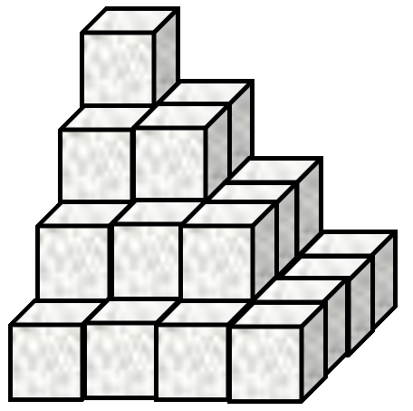
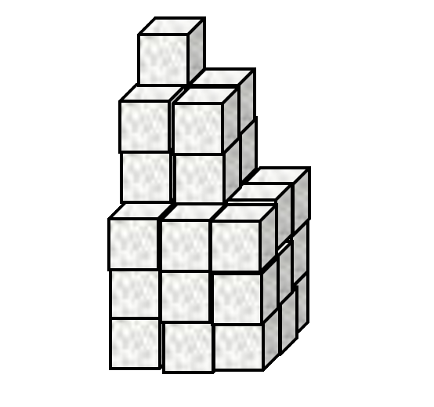

# Problem Set 1: First Steps
1. A Mathematical Notation

	Use APL to evaluate the following

	1. $\prod_{n=1}^{12} n$ (multiply together the first twelve integers)

	2. $\sum_{n=1}^{17}n^2$ (add together the first seventeen squared integers)

	3. $\sum_{n=1}^{100}2n$ (add together the first one hundred positive even integers)

	4. $\sum_{n=1}^{100}2n-1$ (add together the first one hundred odd integers)

	5. In traditional mathematical notation (TMN), the following equation equals `0`, why does the following return `70`?

		          84 - 12 - 1 - 13 - 28 - 9 - 6 - 15  
		    70

	??? Example "Answers"
		<ol type="a">
		<li>$\prod_{n=1}^{12} n$
		<pre><code>      ×/⍳12
		479001600</code></pre></li>
		<li>$\sum_{n=1}^{17}n^2$
		<pre><code>      +/(⍳17)*2
		1785</code></pre></li>
		<li>$\sum_{n=1}^{100}2n$
		<pre><code>      +/2×⍳100
		10100</code></pre></li>
		<li>$\sum_{n=1}^{100}2n-1$
		<pre><code>      +/¯1+2×⍳100
		10000</code></pre></li>
		<li>Expressions are grouped with long right scope and short left scope, rather than using [BODMAS](https://en.wikipedia.org/wiki/Order_of_operations#Mnemonics). With parentheses, the APL and TMN can be made equivalent:
		<pre><code>      84 - (12 - (1 - (13 - (28 - (9 - (6 - 15))))))
		70
		      (((((((84 - 12) - 1) - 13) - 28) - 9) - 6) - 15)
		0</code></pre>
		</ol>

*[TMN]: Traditional Mathematical Notation

2. Pyramid Schemes
	1. Sugar cubes are stacked in an arrangement as shown by **Figure 1**.

		
			<figcaption><strong>Figure 1.</strong> Stacked sugar cubes</figcaption>

		This stack has `4` **layers** and a total of `30` cubes. How many cubes are there in a similar stack with `467` **layers**?

	1. Now consider the stack in **Figure 2**.

		
			<figcaption><strong>Figure 2.</strong> Differently stacked sugar cubes</figcaption>

		The arrangement in **Figure 2** has `4` **layers** and `84` cubes. How many cubes are there in a similar stack with `812` **layers**?

	1. Now look at **Figure 3**.

		
			<figcaption><strong>Figure 3. </strong>This is just a waste of sugar cubes by now...</figcaption>

		The stack in **Figure 3** has `3` **"layers"** and `36` cubes in total. How many cubes are there in a similar stack with `68` **"layers"**?

	??? Example "Answers"
		<ol type="a">
			<li>  
			<pre><code>      +/(⍳467)*2
		34058310</code></pre></li>
			<li>  
			<pre><code>      +/(¯1+2×⍳812)\*2
		713849500</pre></code></li>
			<li>  
			<pre><code>      +/(⍳68)\*3
		5503716</pre></code></li>
		</ol>

3. What's in a Vector?  
	`⎕AVU` is a list (vector) of numbers (don't worry about what it represents). Find the following properties of `⎕AVU`:  
	1. Find the sum of all the values in `⎕AVU`.

	2. Find the product of all the values in `⎕AVU`.

	3. What is the length of `⎕AVU`?

	4.  Find the mean average of `⎕AVU`.

	??? Example "Answers"
		<ol type="a">
			<li>  
			<pre><code>      +/⎕AVU
		646112</code></pre></li>
			<li>  
			<pre><code>      ×/⎕AVU
		0</code></pre></li>
			<li>There are many ways to compute the number of numbers in a numeric vector. Here are a couple:
			<pre><code>      +/⎕AVU=⎕AVU
		256
		      +/⎕AVU*0
		256
		      +/1+⎕AVU×0
		256</code></pre></li>
			<li> The mean average is the sum divided by the length:
			<pre><code>      (+/⎕AVU)÷+/⎕AVU=⎕AVU
		2523.875</code></pre></li>
		</ol>