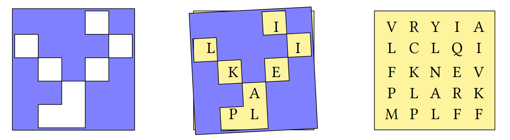

# Array Logic and Data-driven Conditionals

## Logic and conditions
APL has logical and comparison functions as in-built primitives. Much like the arithmetic, these symbols are like those used in conventional notation.

<div class="center language-APL" markdown="span">
<div class="displayBox" markdown="span">
<a class="glyph" title="Less than">`<`</a>
<a class="glyph" title="Less than or equal to">`≤`</a>
<a class="glyph" title="Equals">`=`</a>
<a class="glyph" title="Not equals">`≠`</a>
<a class="glyph" title="Greater than or equal to">`≥`</a>
<a class="glyph" title="Greater than">`>`</a>
<a class="glyph" title="Logical AND">`∧`</a>
<a class="glyph" title="Logical OR">`∨`</a>
<a class="glyph" title="Logical NAND">`⍲`</a>
<a class="glyph" title="Logical NOR">`⍱`</a>
<a class="glyph" title="Logical NOT">`~`</a>
</div>
</div>

Some of these are more general mathematical functions which happen to be the same as logical functions when used with Booeleans (`1`s and `0`s):

```APL
      3 ∧ 4               ⍝ Lowest common multiple
```
```
12
```
---
```APL
      0 1 0 1 ∧ 0 0 1 1   ⍝ Logical AND
```
```
0 0 0 1
```
---
```APL
      12 ∨ 16             ⍝ Greatest common divisor
```
```
4
```
---
```APL
      0 1 0 1 ∨ 0 0 1 1   ⍝ Logical OR
```
```
0 1 1 1
```
---
```APL
      'P' ≠ 'Q'           ⍝ Not equal to
```
```
1
```
---
```APL
      0 1 0 1 ≠ 0 0 1 1   ⍝ Logical XOR 
```
```
0 1 1 0
```

!!!Info
	The [16 possible logic functions for two binary variables](https://en.wikipedia.org/wiki/Truth_table#Binary_operations) can all be expressed succinctly in APL, as shown in the [notebook](https://nbviewer.org/github/Dyalog/dyalog-jupyter-notebooks/blob/master/Boolean%20Scans%20and%20Reductions.ipynb) and [webinar](https://dyalog.tv/Webinar/?v=erv_1LxEByk) on Boolean scans and reductions.

## The shape of data
One of the distinguishing features of APL is the multidimensional array. Single elements, lists and tables are quite familiar constructs.

Tables are very useful for representing data which is related in some way. For example, let's say that the price of oranges changes daily. We can represent a week of prices as a 7-element numeric list.

```APL
0.35 0.3 0.33 0.32 0.39 0.33 0.36
```

How about the amount spent on 3 items? We could store this in 3 separate lists, but it is convenient to keep it in a table with 3 rows and 7 columns.

The <dfn>reshape</dfn> function `⍺⍴⍵` takes data from `⍵` and uses it to fill out an array of shape `⍺`, one row at a time.

```APL
      cost ← 3 7⍴4.36 4.22 4.05 4.14 4.18 4.19 4.02 2.79 2.58 2.68 2.77 2.88 2.79 2.52 3.07 3 3.13 3 3.24 3.06 3.29
	  cost
```
```
4.36 4.22 4.05 4.14 4.18 4.19 4.02
2.79 2.58 2.68 2.77 2.88 2.79 2.52
3.07 3    3.13 3    3.24 3.06 3.29
```

So what is this table that we have created? In other languages, there are lists, and there are lists of lists. In APL, a list of lists is not the same thing as a table (also known as a matrix). APL arrays contain two essential pieces of information: their shape and their list of elements.

The <dfn>shape</dfn> function `⍴⍵` returns the shape of its argument.

```APL
      ⍴4 12 31
3
```

The following table lists the <dfn>rank</dfn> (number of dimensions), some common names, and a geometric analogy for the three simplest types of multidimensional arrays.

|Rank|Name|Geometric analogy|diagram|
|---|---|---|---|
|$0$|scalar|point||
|$1$|vector or list|line||
|$2$|matrix or table|rectangle||

Arrays with $3$ or more dimensions are sometimes called <dfn>cube</dfn> or <dfn>cuboid</dfn>, but they are generally referred to as <dfn>N-dimensional arrays</dfn>, <dfn>rank-N arrays</dfn> or <dfn>high rank arrays</dfn>. Arrays of rank greater than $3$ are sometimes called <dfn>noble arrays</dfn>.

For our `cost` matrix, the total spent on each item is a row-wise sum:
```APL
      +/cost    ⍝ The total cost over the week
```
```
29.16 19.01 21.79
```
---
```APL
      ⍴+/cost   ⍝ For 3 items
```
```
3
```

The total for each day across all items is a column-wise sum:

```APL
      +⌿cost    ⍝ The total cost of 3 items
```
```
10.22 9.8 9.86 9.91 10.3 10.04 9.83
```
---
```APL
      ⍴+⌿cost   ⍝ Over 7 days
```
```
7
```

## Ravel means unravel :thread:
Monadic comma is the function <dfn>ravel</dfn> `,⍵` and it lays out the elements of an array as a vector, one row at a time — a bit like pulling thread from a spool.

```APL
      mat ← 3 3⍴⎕A
      mat
```
```
ABC
DEF
GHI
```
---
```APL
      ,mat
```
```
ABCDEFGHI
```

## The outer product
The "outer product" `∘.F` operator applies its function operand `F` between all combinations of elements of its left and right argument arrays. 

```APL
      F ← {⍺+⍵}
      1 2 3 ∘.F 10 20 30
```
```
11 21 31
12 22 32
13 23 33
```

For example, the catenate function `⍺,⍵` (comma) will join two lists together. We can use the outer product to join combinations of words from two lists. 

```APL
      1 4 9 , 6 5 4
```
```
1 4 9 6 5 4
```
---
```APL
      'joined up' , 'text vectors'
```
```
joined uptext vectors
 
```
---
```APL
      'chicken' 'pork' 'vegetable' ∘., ' chow mein' ' with cashew nuts'
```
```
┌───────────────────┬──────────────────────────┐
│chicken chow mein  │chicken with cashew nuts  │
├───────────────────┼──────────────────────────┤
│pork chow mein     │pork with cashew nuts     │
├───────────────────┼──────────────────────────┤
│vegetable chow mein│vegetable with cashew nuts│
└───────────────────┴──────────────────────────┘
```

!!!Question "What are those boxes around the output?"
	We have just created a <dfn>nested array</dfn>. These are arrays in which each element contains another array more complex than a single number or character. The next section on [multidimensional and nested arrays](./multidimensional-and-nested-arrays.md) introduces them in more detail.

	If you do not see lines around the output of the last expression above in your interpreter session, turn boxing on:
	```APL
	      ]box on
	```
	```
	Was OFF
	```
	---
	```APL
	      ⍳3 3
	```
	```
	┌───┬───┬───┐
	│1 1│1 2│1 3│
	├───┼───┼───┤
	│2 1│2 2│2 3│
	├───┼───┼───┤
	│3 1│3 2│3 3│
	└───┴───┴───┘
	```

## Replicate/Compress
The <dfn>replicate</dfn> function `⍺/⍵` (yes, some symbols have <a target="_blank" href="https://aplwiki.com/wiki/Function-operator_overloading">multiple meanings</a>) repeats elements of an array along rows.

```APL
      1 2 3/'ABC'
```
```
ABBCCC
```
---
```APL
      1 2 3/2 3⍴'DYALOG'
```
```
DYYAAA
LOOGGG
```
---
```APL
      1 ¯2 3/2 3⍴'DYALOG'
```
```
D  AAA
L  GGG
```

When used with a Boolean array, the function `⍺/⍵` is called <dfn>compress</dfn>.

```APL
      0 1 0/2 3⍴'DYALOG'
```
```
Y
O
```

Just like the forward-slash `F/` as the *reduction operator* acts along rows and forward-slash-bar `F⌿` reduces down columns*, the replicate `⍺/⍵` and <dfn>replicate-first</dfn> `⍺⌿⍵` functions work along different axes of high rank arrays.

*we will see a fuller description [when we discuss 3D and higher rank arrays](./cells-and-axes.md).

## Indexing
In many other programming languages, "[selection](https://www.bbc.co.uk/bitesize/guides/zh66pbk/revision/3)" is used to describe control structures such as "[if then else](https://en.wikipedia.org/wiki/Conditional_(computer_programming)#If%E2%80%93then(%E2%80%93else))" or "[switch case](https://en.wikipedia.org/wiki/Conditional_(computer_programming)#Case_and_switch_statements)". In APL, we can get a similar effect by literally "selecting" elements from arrays. 

!!!Info
	Indexing starts from 1 by default. You can change the index origin by setting `⎕IO←0`, but this course assumes `⎕IO←1`.

```APL
      'APPLE'[1 3 4]
```
```
APL
```
---
```APL
      ⍸ 1 0 0 1 0 1
```
```
1 4 6
```
---
```APL
      IsDivisibleBy ← {0=⍵|⍺}
      3 6 8 5 2 IsDivisibleBy 2
```
```
0 1 1 0 1
```
---
```APL
      3 6 8 5 2 {⍺[⍸⍺ IsDivisibleBy ⍵]} 2
```
```
6 8 2
```

## Problem set 3

1. Define the numeric vector `nums`
	
	```APL
	nums ← 3 5 8 2 1
	```

	1. Using `nums`, define `mat`

	```APL
	      mat
	```
	```
	3 5 8
	2 1 3
	```

	1. Using `mat`, define `wide`

	```APL
	      wide
	```
	```
	3 5 8 3 5 8
	2 1 3 2 1 3
	```

	1. Using `mat`, define `stack`

	```APL
	      stack
	```
	```
	3 5 8
	3 5 8
	2 1 3
	2 1 3
	```

	???Example "Answers"
		<ol type="a">
		<li>
		```APL
		mat ← 2 3⍴nums
		```
		</li>
		<li>
		```APL
		wide ← mat,mat
		```
		</li>
		<li>
		```APL
		stack ← 2⌿mat
		```
		</li>
		</ol>

1. Why does `101='101'` evaluate to a 3-element list?

	???Example "Answer"
		`101` is a literal single number (a scalar), whereas `'101'` is a literal 3-element character vector.
		
		Due to [singleton extension](./basic-syntax-and-arithmetic.md#singleton-extension), `101='101'` compares the single number `101` to each of the 3 characters in the 3-element character vector `'101'`.	The character vector `'101'` is equivalent to `'1' '0' '1'` but the number `101` is not the same as the 3-element numeric vector `1 0 1`.

1. Write a function `PassFail` which takes an array of scores and returns an array of the same shape in which `F` corresponds to a score less than 40 and `P` corresponds to a score of 40 or more.

	```APL
	      PassFail 35 40 45
	```
	```
	FPP
	```
	---
	```APL
	      PassFail 2 5⍴89 77 15 49 72 54 25 18 57 53
	```
	```
	PPFPP
	PFFPP
	```

	???Example "Answer"
		```APL
		PassFail ← {'FP'[1+40≤⍵]}
		```

1. This problem is taken from the [2019 APL Problem Solving Competition](https://www.dyalog.com/student-competition.htm).

	A Grille is a square sheet with holes cut out of it which, when laid on top of a similarly-sized character matrix, reveals a hidden message.

	

	Write an APL function `Grille` which:

	- takes a character matrix left argument where a hash `'#'` represents opaque material and a space `' '` represents a hole.
	- takes a character matrix of the same shape as right argument
	- returns the hidden message as a character vector

	```APL
	      (2 2⍴'# # ') Grille 2 2⍴'LHOI'
	```
	```
	HI
	```
	---
	```APL
	      grid   ← 5 5⍴'VRYIALCLQIFKNEVPLARKMPLFF'
		  grille ← 5 5⍴'⌺⌺⌺ ⌺ ⌺⌺⌺ ⌺ ⌺ ⌺⌺⌺ ⌺⌺⌺  ⌺⌺'
		  grid grille
	```
	```
	┌─────┬─────┐
	│VRYIA│⌺⌺⌺ ⌺│
	│LCLQI│ ⌺⌺⌺ │
	│FKNEV│⌺ ⌺ ⌺│
	│PLARK│⌺⌺ ⌺⌺│
	│MPLFF│⌺  ⌺⌺│
	└─────┴─────┘
	```
	---
	```APL
		  grille Grille grid
	```
	```
	THISISFUN
	```

	???Example "Answer"

		We can use the **where** function `⍸⍵` to compute indices of spaces:

		```APL
		Grille ← {⍵[⍸⍺=' ']}
		```

		Or, we can use **compress** `⍺/⍵` if we first ravel `,⍵` both arguments:

		```APL
		Grille ← {(,⍺=' ')/,⍵}
		```

1. Back to School
	1. Write a function to produce the multiplication table from `1` to `⍵`. 

		<pre><code class="language-APL">      MulTable 7</code></pre>
		<pre><code class="language-APL">1  2  3  4  5  6  7
		2  4  6  8 10 12 14
		3  6  9 12 15 18 21
		4  8 12 16 20 24 28
		5 10 15 20 25 30 35
		6 12 18 24 30 36 42
		7 14 21 28 35 42 49</code></pre>

	1. Write a function to produce the addition table from `0` to `⍵`.

		<pre><code class="language-APL">      AddTable 6</code></pre>
		<pre><code class="language-APL">0 1 2 3  4  5  6
		1 2 3 4  5  6  7
		2 3 4 5  6  7  8
		3 4 5 6  7  8  9
		4 5 6 7  8  9 10
		5 6 7 8  9 10 11
		6 7 8 9 10 11 12</code></pre>

	???Example "Answers"
		<ol type="a">
		<li>

		```APL
		MulTable ← {(⍳⍵)∘.×⍳⍵}
		```

		Avoid repeating yourself by assigning values to a name:

		```APL
		MulTable ← {i∘.×i←⍳⍵}
		```

		Or, if left and right arguments to a dyadic function are the same, use a <dfn>selfie</dfn> `F⍨⍵`:

		```APL
		MulTable ← {∘.×⍨⍳⍵}
		```

		</li>
		<li>

		```APL
		AddTable ← {(¯1+⍳1+⍵)∘.+¯1+⍳1+⍵}
		AddTable ← {i∘.+i←¯1+⍳1+⍵}
		AddTable ← {∘.+⍨¯1+⍳1+⍵}
		```

		</li>
		</ol>

1. Making the Grade

	<table id="gradeBoundaryTable" style="border-top: none;">
	<tbody>
	<tr>
	<td><strong>Score Range</strong></td>
	<td><code>0-64</code></td>
	<td><code>65-69</code></td>
	<td><code>70-79</code></td>
	<td><code>80-89</code></td>
	<td><code>90-100</code></td>
	</tr>
	<tr>
	<td><strong>Letter Grade</strong></td>
	<td>F</td>
	<td>D</td>
	<td>C</td>
	<td>B</td>
	<td>A</td>
	</tr>
	</tbody>
	</table>

    Write a function that, given an array of integer test scores in the inclusive range 0 to 100, returns a list of letter grades according to the table above.

	<pre><code class="language-APL">      Grade 0 10 75 78 85</code></pre>
	<pre><code class="language-APL">FFCCB</code></pre>

	???Example "Answer"
		Use an outer product to compare between lower bounds and the scores. The column-wise sum then tells us which "bin" each score belongs to:

		```APL
		Grade ← {'FDCBA'[+⌿0 65 70 80 90∘.≤⍵]}
		```

		You can use a different comparison if you choose to use upper bounds:

		```APL
		{'ABCDF'[+⌿64 69 79 89 100∘.≥⍵]}
		```

1. Analysing text

	1. Write a function test if there are any vowels `'aeiou'` in text vector `⍵`

		```APL
		      AnyVowels 'this text is made of characters'
		1
		      AnyVowels 'bgxkz'
		0
		```

	1. Write a function to count the number of vowels in its character vector argument `⍵`

		```APL
		      CountVowels 'this text is made of characters'
		```
		```
		9
		```
		---
		```APL
		      CountVowels 'we have twelve vowels in this sentence'
		```
		```
		12
		```

	1. Write a function to remove the vowels from its argument

		```APL
		      RemoveVowels 'this text is made of characters'
		ths txt s md f chrctrs
		```

	???Example "Answers"
		<ol type="a">
		<li>
		With two *or-reductions*, we ask "are there any `1`s in each row?" Then, "are there any `1`s in any of the rows?"
		
		```APL
		AnyVowels ← {∨/∨/'aeiou'∘.=⍵}
		```

		Or we can ravel the contents of the array into a vector to perform one big or-reduction across all elements:

		```APL
		AnyVowels ← {∨/,'aeiou'∘.=⍵}
		```

		</li>
		<li>

		Similar techniques can be used for counting the ones:

		```APL
		CountVowels ← {+/+/'aeiou'∘.=⍵}
		CountVowels ← {+/,'aeiou'∘.=⍵}
		```

		Because we are comparing a single vector, +⌿ and ∨⌿ both tell us if there is any vowel in that position:

		```APL
		CountVowels ← {+/+⌿'aeiou'∘.=⍵}
		CountVowels ← {+/∨⌿'aeiou'∘.=⍵}
		```

		</li>
		<li>
		To remove vowels, we must consider the columns of our outer product equality. We then keep elements which are not `~⍵` vowels.

		```APL
		RemoveVowels ← {⍵/⍨~∨⌿'aeiou'∘.=⍵}
		```

		Or rows if the arguments to our outer product are swapped:

		```APL
		RemoveVowels ← {⍵/⍨~∨/'aeiou'∘.=⍵}
		```

		Since we are compressing elements out of a vector, we can use either replicate `⍺/⍵` or replicate-first `⍺⌿⍵`. This is because a vector only has a single dimension, or axis, and that axis is both the first and the last.

		```APL
		RemoveVowels ← {⍵/⍨∨⌿'aeiou'∘.=⍵}
		RemoveVowels ← {⍵⌿⍨∨⌿'aeiou'∘.=⍵}
		```

		</li>

1. Matching shapes
	1. 
		Write a function to add a vector `⍵` to each row of a matrix `⍺`:

		```APL
		      (3 2⍴1 100) AddRows 1 9
		2 109
		2 109
		2 109
		      (5 3⍴1 10 100 1000) AddRows 5 10 15
		6   20  115
		1005   11   25
		105 1010   16
		15  110 1015
		6   20  115
		```

	1. Write a function to add a vector to each row of a matrix, regardless of the order in which they are supplied:

		```APL
		      1 9 AddRows 3 2⍴1 100
		2 109
		2 109
		2 109
		      (2 2⍴1 9 11 18) AddRows 9 1
		10 10
		20 19
		```

	???Example "Answers"
		<ol type="a">
		<li>
		Reshape recycles elements. We can use this to duplicate rows until we have the correct shape to allow `+` to map between elements for us:
		```APL
		AddRows ← {⍵+(⍴⍵)⍴⍺}
		```
		</li>
		<li>
		Finding the maximum shape is a more general solution:
		```APL
		AddRows ← {s←(⍴⍺)⌈⍴⍵ ⋄ (s⍴⍺)+s⍴⍵}
		```

		This way of applying functions between arrays of different shapes is very common. As with many things in this course, eventually we will discover more elegant methods. Here is an example of using [the rank operator](./cells-and-axes.md#the-rank-operator):

		```APL
		AddRows ← +⍤1
		```
		</li>
		</ol>

1. These are the heights of some students in 3 classes.
	```APL
	student ← 10 7⍴'Kane   Jonah  JessicaPadma  Katie  CharlieAmil   David  Zara   Filipa '
	class ← 'CBACCCBBAB'
	height ← 167 177 171 176 178 164 177 177 173 160
	```

	Use APL to:

	1. Find the height of the tallest student
	1. Find the name of the tallest student
	1. Find the class to which the tallest student belongs  
	1. Find the average height of students in class `B`
	
	???Example "Answers"
		<ol type="a">
		<li>
		```APL
		      ⌈/height
		178
		```
		</li>
		<li>
		```APL
		      (height=⌈/height)⌿student
		Katie
		```
		</li>
		<li>
		```APL
		      (height=⌈/height)⌿class
		C
		```

		You might have tried to use indexing and gotten an error:

		```APL
		RANK ERROR
				student[⍸height=⌈/height]
						∧
		```	

		There is [additional syntax](./selecting-from-arrays.md#square-bracket-indexing) in order to select from matrices and higher rank arrays.

		</li>
		<li>
		We can use either compress or indexing to select from the `height` vector:
		```APL
		      Mean ← {(+/⍵)÷≢⍵}
		      Mean (class='B')/height
		172.75
		      Mean height[⍸class='B']
		172.75
		```
		</li>
		</ol>

1. Optimus Prime

	A prime number is divisible by only itself and `1`.

	Write a dfn which returns all of the prime numbers between `1` and `⍵`.

	```APL
	      Primes 10
	```
	```
	2 3 5 7
	```
	---
	```
	      Primes 30
	```
	```
	2 3 5 7 11 13 17 19 23 29
	```

	???Example "Answer"
		```APL
		Primes ← {⍸2=+⌿0=∘.|⍨⍳⍵}
		```

		An alternative coding uses the multiplication table:

		```APL
		Primes ← {i~∘.×⍨i←1↓⍳⍵}
		```

		Of course, the outer product `∘.F` indicates that the number of calculations to compute both of these solutions increases with the square of the input size. We say they have a computational complexity "*of order n squared*" or $O(n^2)$ in [big-O notation](https://en.wikipedia.org/wiki/Big_O_notation). This is a very inefficient way to find prime numbers.
		To see discussions around more efficient ways to compute prime numbers in APL, see [the dfns page on prime numbers](https://dfns.dyalog.com/n_pco.htm).