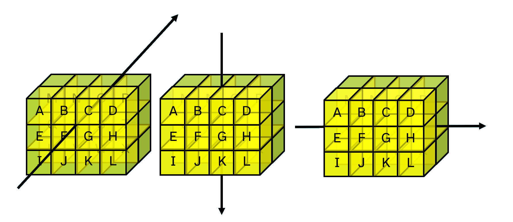

# Cells and axes

## Fundamentals of high rank arrays
From the APL Wiki: 
<blockquote>
      A <a target="_blank" href="https://aplwiki.com/wiki/Cell">cell</a> is a subarray which is formed by selecting a single index along some number of leading axes and the whole of each trailing axis. Cells are classified by their rank, which may be between 0 (scalars) and the array's rank (in which case the cell must be the entire array). Cells with rank k are called k-cells of an array. A major cell is a cell whose rank is one less than the entire array, or a 0-cell of a scalar. 
</blockquote>
If the text above feels confusing, don't worry. Maybe after this chapter, or even after the next section on selecting from arrays, you can read it again and say to yourself "oh yeah, that makes sense". For now just know that that arrays are arranged like rectangles in many dimensions. The three simplest cases should feel a bit familiar to you.

```APL
      0            ⍝ A scalar
0
      'APL'        ⍝ A vector
APL
      0 1 2∘.*⍳5   ⍝ A matrix
0 0 0  0  0
1 1 1  1  1
2 4 8 16 32
```

Now let us look at an array with 3 dimensions. We will call it a **cuboid**:

```APL
      ⍴cuboid←2 3∘.+3 4 5∘.×4 5 6 7
2 3 4 ← trailing (last) axis
↑
leading (first) axis
```

In the array `cuboid` defined above, there are `2` **major cells**, which are those of rank `¯1+≢⍴cuboid`.

Here is another 3D array containing letters of the alphabet:

```APL
      2 3 4⍴⎕A
ABCD
EFGH
IJKL
    
MNOP
QRST
UVWX
      ≢2 3 4⍴⎕A      ⍝ Tally counts the major cells
2
```

The display may look like 2 separate matrices, but the array `2 3 4⍴⎕A` is a single, 3 dimensional array.

The dimensions of an array are also known as **axes**. The most major cells, the rank `k-1` cells for an array of rank `k`, lie along the *first* axis. The least major cells are columns which lie along the *last* axis.

<center>
	<figure>
		
		<figcaption>
			Axes of a 3D array
		</figcaption>
	</figure>
</center>

In Dyalog, arrays can have up to 15 dimensions.

For more details on the APL array model in Dyalog and other array languages, see [the APL Wiki article on the array model](https://aplwiki.com/wiki/Array_model).

Now that you know how to describe the structure of an array in terms of its sub-arrays, let us look at how to apply functions to sub-arrays.

## The rank operator
A lot of the time you might want to take a subset of the data and do stuff to it. Sometimes you want to think of the data as a collection of similar parts and apply the same processing to each part. In fact, this idea is built in to the "array-at-a-time" nature of some primitive functions and operators, but the rank operator lets us do this for all functions.

Let us take a 3D array representing the cost of 3 products over 2 weeks bought on all 7 days of each week.

```APL
cost ← ?3 2 7⍴9
```

Sum between the *layers* (rank 2, matrices) of this array to get the total cost over all 3 products each day of each week:

```APL
      +⌿cost
```
```
12 21 13 14 17 20 17
12 25 18 10  9 26 14
```
---
```APL
      ⍴+⌿cost       ⍝ 2 weeks, 7 days per week
```
```
2 7
```

We can tell the function `+⌿` to only *see* rank-2 subarrays. The first axis of each rank-2 subarray is that along which the columns lie. This way, we can get the total spent on each week day over the two weeks:

```APL
      (+⌿⍤2)cost
```
```
 4 18 12  7 9 13  6
17 14  9  7 9 17 13
 3 14 10 10 8 16 12
```
---
```APL
      ⍴(+⌿⍤2)cost   ⍝ 3 products, 7 days per week
```
```
3 7
```

The total spent on each product each week is the row-wise sum.

```APL
      (+⌿⍤1)cost
```
```
28 41
51 35
35 38
```

This is the same as `+/`:

```APL
      +/cost
```
```
28 41
51 35
35 38
```
---
```APL
      ⍴(+⌿⍤1)cost   ⍝ 3 products, 2 weeks
```
```
3 2
```

!!!Note "A helpful tip for operators"
	Many operators accept one or more function <dfn>operands</dfn> and apply them to their arguments in some particular way. The enclose function `⊂⍵` can be used to get a view of the arguments *as the operand function sees them*.

	Apply our function to rank-2 subarrays of the `cost` array.

	```APL
	      (⊂⍤2)cost
	```
	```
	┌─────────────┬─────────────┬─────────────┐
	│2 9 4 1 5 5 2│9 6 8 5 7 8 8│1 6 1 8 5 7 7│
	│2 9 8 6 4 8 4│8 8 1 2 2 9 5│2 8 9 2 3 9 5│
	└─────────────┴─────────────┴─────────────┘
	```

	The result is like doing `+⌿⍵` to each of these matrices.

	```APL
	      (+⌿⍤2)cost
	```
	```
	 4 18 12  7 9 13  6
	17 14  9  7 9 17 13
	 3 14 10 10 8 16 12
	```

In the dyadic case, the rank operator is a powerful way to pair up subarrays of `⍺` with a conforming collection of subarrays from `⍵`.

Let us say that we want to add each of the numbers $1$ to $5$ to corresponding rows in a matrix. We cannot simply add a vector to a matrix because these arrays have different ranks.

```APL
      1 2 3 4 5 + 5 3⍴0 10 100
```
```
RANK ERROR: Mismatched left and right argument ranks
      1 2 3 4 5+5 3⍴0 10 100
               ∧
```

The <dfn>rank operator</dfn> (`F⍤k`) allows us to pair up *scalars* (rank 0) from `⍺` and *vectors* (rank 1) from `⍵` and apply our function `+` between these.

```APL
      1 2 3 4 5 (+⍤0 1) 5 3⍴0 10 100
```
```
1 11 101
2 12 102
3 13 103
4 14 104
5 15 105
```

In the same way that some functions can apply between a single value and an array of values, we can apply between an array of rank $n$ and an array of rank $n$ subarrays. For example, a single vector (rank 1) and a matrix (rank 2) as a collection of vectors.

```APL
      1 0 ¯1 (×⍤1 1) 5 3⍴⍳15
```
```
 1 0  ¯3
 4 0  ¯6
 7 0  ¯9
10 0 ¯12
13 0 ¯15
```

In the case where we apply to sub-arrays of the same rank in both `⍺` and `⍵`, we only need specify that rank once:

```APL
      1 0 ¯1 (×⍤1) 5 3⍴⍳15
```
```
 1 0  ¯3
 4 0  ¯6
 7 0  ¯9
10 0 ¯12
13 0 ¯15
```

When applying a function `F⍤j k`, we must ensure that there are the same number of rank-`j` subarrays in `⍺` as rank-`k` subarrays in `⍵` - or that one of them has just 1.

```APL
      1 0 ¯1 (×⍤0 1) 5 3⍴⍳15
```
```
LENGTH ERROR: It must be that either the left and right frames match or one of them has length 0
      1 0 ¯1(×⍤0 1)5 3⍴⍳15
            ∧
```

!!!Note Conforming arrays have either same shape or one is a unit
	With functions like `+ × ÷`, arrays must either have the same shape, or one of them be a scalar. The result of the function application has the same shape as the largest of the input arrays. The rank operator generalises this to the concept of <dfn>frames</dfn>. A frame is a rank-k cell of some array. For frames to "match" means that there are the same number of rank **j** subarrays of `⍺` as there are rank **k** subarrays of `⍵` when a function `⍺ F ⍵` is applied as `⍺ (F⍤j k) ⍵`.

## Transpose
To <dfn>transpose</dfn> array is to rearrange its axes. Or rather, to rearrange along which axes its data lies.

Transposing a matrix is to flip along its diagonal:

```APL
      3 3⍴⍳9
```
```
1 2 3
4 5 6
7 8 9
```
---
```APL
      ⍉3 3⍴⍳9
```
```
1 4 7
2 5 8
3 6 9
```

In the monadic case, we reverse the order of the axes:

```APL
      2 3 4⍴⎕A
```
```
ABCD
EFGH
IJKL

MNOP
QRST
UVWX
```
---
```APL
      ⍉2 3 4⍴⎕A
```
```
AM
EQ
IU

BN
FR
JV

CO
GS
KW

DP
HT
LX
```

Inspecting the shape before and after transposing.

```APL
      ⍴2 3 4⍴⎕A
```
```
2 3 4
```
---
```APL
      ⍴⍉2 3 4⍴⎕A   ⍝ 4 3 2 ≡ ⌽2 3 4
```
```
4 3 2
```

In the dyadic case, the left argument says where each corresponding axis in `⍴⍵` should end up in the result.

For example:

- move the 1st axis to become the 2nd
- move the 2nd axis to become the 1st
- leave the 3rd axis as the 3rd

```APL
      2 1 3⍉2 3 4⍴⎕A
```
```
ABCD
MNOP

EFGH
QRST

IJKL
UVWX
```
---
```APL
      ⍴2 1 3⍉2 3 4⍴⎕A
```
```
3 2 4
```

Because the rank operator only works along *trailing* axes, we may want to transpose our data in order to work along certain dimensions.

## The bracket axis operator
We have seen two pairs of *first-* and *last-axis* primitives.

```APL
      n←2 3⍴1 2 3 1 0 ¯1
      n
1 2  3
1 0 ¯1
      +/n                ⍝ Sum along the last axis
6 0
      +⌿n                ⍝ Sum along the first axis
2 2 2
      '-'⍪2 3⍴'DYALOG'   ⍝ Catenate first
---
DYA
LOG
      '|',2 3⍴'DYALOG'   ⍝ Catenate last
|DYA
|LOG
```

Some functions and operators can be used along specified axes using the **function axis operator** `[]` (more <a target="_blank" href="https://aplwiki.com/wiki/Function-operator_overloading">duplicitous</a> symbols).

Compare the behaviour of the monadic function `⊂` *enclose* when applied with the rank operator `⍤` versus when it is applied using **bracket axis** (also called the *function axis operator* or *axis specification* `[]`).

```APL
      (⊂⍤1)2 2 5⍴'RIGHTHELLOTHERE'
```
```
┌─────┬─────┐
│RIGHT│HELLO│
├─────┼─────┤
│THERE│RIGHT│
└─────┴─────┘
```
---
```APL
      (⊂⍤2)2 2 5⍴'RIGHTHELLOTHERE'
```
```
┌─────┬─────┐
│RIGHT│THERE│
│HELLO│RIGHT│
└─────┴─────┘
```
---
```APL
      (⊂⍤3)2 2 5⍴'RIGHTHELLOTHERE'
```
```
┌─────┐
│RIGHT│
│HELLO│
│     │
│THERE│
│RIGHT│
└─────┘
```
---
```APL
      ⊂[1]2 2 5⍴'RIGHTHELLOTHERE'
```
```
┌──┬──┬──┬──┬──┐
│RT│IH│GE│HR│TE│
├──┼──┼──┼──┼──┤
│HR│EI│LG│LH│OT│
└──┴──┴──┴──┴──┘
```
---
```APL
      ⊂[2]2 2 5⍴'RIGHTHELLOTHERE'
```
```
┌──┬──┬──┬──┬──┐
│RH│IE│GL│HL│TO│
├──┼──┼──┼──┼──┤
│TR│HI│EG│RH│ET│
└──┴──┴──┴──┴──┘
```
---
```APL
      ⊂[3]2 2 5⍴'RIGHTHELLOTHERE'
```
```
┌─────┬─────┐
│RIGHT│HELLO│
├─────┼─────┤
│THERE│RIGHT│
└─────┴─────┘
```
---
```APL
      ⊂[1 2]2 2 5⍴'RIGHTHELLOTHERE'
```
```
┌──┬──┬──┬──┬──┐
│RH│IE│GL│HL│TO│
│TR│HI│EG│RH│ET│
└──┴──┴──┴──┴──┘
```
---
```APL
      ⊂[2 3]2 2 5⍴'RIGHTHELLOTHERE'
```
```
┌─────┬─────┐
│RIGHT│THERE│
│HELLO│RIGHT│
└─────┴─────┘
```
---
```APL
      ⊂[1 2 3]2 2 5⍴'RIGHTHELLOTHERE'
```
```
┌─────┐
│RIGHT│
│HELLO│
│     │
│THERE│
│RIGHT│
└─────┘
```

**Pros:**

- some uses of bracket-axis are shorter simpler than their equivalent expression using rank and transpose
- by forcing the user to apply it directly to primitives, it can lead to faster code in the Dyalog interpreter
- some people are used to thinking in terms of axes using bracket-axis, rather than in terms of cells using the rank operator

**Cons**

- it can only be used with a few particular primitives, whereas the rank operator can be used with any function including those defined by the user
- it works slightly differently depending on the function to which it is applied, whereas rank has consistent behaviour for all functions
- it is special syntax unlike most other operators
- it involves implicit transposes of the array data

For a more in-depth look at the relationship between function rank and function axis, watch the Dyalog webinars on [Selecting from Arrays](https://dyalog.tv/Webinar/?v=AgYDvSF2FfU) and [The Rank Operator and Dyadic Transpose](https://dyalog.tv/Webinar/?v=zBqdeDJPPRc).

A list of functions with bracket-axis definitions can be found on [the APL Wiki page for function axis](https://aplwiki.com/wiki/Function_axis).

The [section about older features](./Quirks.md) has some more examples of bracket axis.

The following functions can be used with the axis operator:

|Monadic Functions|Function Names|
|---|---|
|`↑⍵` and `↓⍵`|Mix and Split|
|`⌽⍵` or `⊖⍵`|Reverse|
|`,⍵`|Ravel with axis|
|`⊂⍵`|Enclose with axis|
|`F/⍵` or `F⌿⍵`|Reductions|
|`F\⍵` or `F⍀⍵`|Scans|

|Dyadic Functions|Function Names|
|---|---|
|`+ × ⌈ ∧ ≤` etc...|All *scalar dyadic functions*|
|`⍺↑⍵` and `⍺↓⍵`|Take and Drop|
|`⍺/⍵` or `⍺⌿⍵`|Replicate/compress|
|`⍺\⍵` or `⍺⍀⍵`|Expand|
|`⍺,⍵` or `⍺⍪⍵`|Catenate|
|`⍺⊂⍵`|Partitioned-enclose|
|`⍺⊆⍵`|Partition|
|`⍺F/⍵` or `⍺F⌿⍵`|Windowed-reduction|


## Problem set
1. Write a function `FlipBlock` which reverses the columns in each sub-matrix of its argument array.

	```APL
	      FlipBlock 2 2 3⍴0 0 0 1 1 1
	1 1 1
	0 0 0

	1 1 1
	0 0 0
	```

	If there is only 1 row in each sub-matrix, reversing does nothing:
	```APL
	      FlipBlock 1 5⍴'abcde'
	```
	```
	abcde
	```

	If there is only one dimension, the array will be reversed:

	```APL
	      FlipBlock 'abcde'
	```
	```
	edcba
	```

1. Write a function `MatchWord` which takes a character vector left argument `⍺` and a character array `⍵` with the same number of columns as `⍺` and returns a Boolean array of rank `¯1+≢⍺` in which a `1` indicates rows in `⍵` that match `⍺`.

	```APL
	      'has' MatchWord 5 3⍴'hasnotnot'
	```
	```
	1 0 0 1 0
	```
	---
	```APL
	      'simon' MatchWord 3 2 5⍴'maybesimonspoke'
	```
	```
	0 1
	0 0
	1 0
	```

1. Extend the `Grille` function from the problem set about [array logic](./array-logic-data-driven-conditionals.md#TODO) to reveal multiple messages in a 3-dimensional array.

	```APL
	grille  ← 4 4⍴'⌺ ⌺⌺ ⌺ ⌺⌺ ⌺  ⌺⌺⌺'
	grilles ← 3 4 4⍴'⌺⌺ ⌺⌺⌺⌺ ⌺⌺⌺⌺⌺ ⌺⌺⌺⌺⌺ ⌺⌺⌺⌺ ⌺⌺⌺⌺⌺ ⌺⌺⌺⌺⌺⌺ ⌺ ⌺⌺ ⌺⌺⌺⌺⌺'
	grid    ← 3 4 4⍴'AREQEEVASEQALTOFBSMBESCTIRMETOGPGHIAAACPSKLERVRG'
	```
	
	The single `grille` reveals 3 messages.
	
	```APL
	      grille Grille grid
	```
	```
	REVEAL
	SECRET
	HACKER
	```
	
	The array `grilles` reveals 3 different messages when applied to the same grid.
	
	```APL
	      grilles Grille grid
	```
	```
	EAT
	BIG
	APL
	```

1.  

	The 3D array `rain` gives the monthly rainfall in millimeters over 7 years in 5 countries.  

	```APL
	rain←?7 5 12⍴250
	```

	There are 12 columns in each row; the rows represent the months. The sum along the rows...
	
	```APL
	      (+⌿⍤1)rain
	```
	```
	1476 1764 1733 1320 1678
	1698 1943  798 2226 1813
	2050 1821 1209 1763 1625
	2006 1218 1615 1516 1536
	1372 1584 1946 1604 1623
	1831 1705 1998 1312 1224
	1499 1369 1437 1597 1279
	```
	---
	```APL
	      ⍴(+⌿⍤1)rain
	```
	```
	7 5
	```

	...gives the total rainfall in each year in each country over 12 months. Put another way, it is the total annual rainfall each year in each country.
	
	1. For each expression below, write a brief description of the resulting statistic.

		```APL
		+⌿rain
		(+⌿⍤2)rain
		(+⌿⍤3)rain
		⌈⌿rain
		(⌈⌿⍤2)rain
		rain[⍸rain>250]
		```
		```
		```

		??? Hint
			Look at the shapes of the arguments and the results, <code class='language-apl'>⍴rain</code> and <code class='language-apl'>⍴+⌿rain</code> etc.

	1. Assign scalar numeric values (single numbers) to the variables `years` `countries` `months` such that the `rain` data can be summarised as follows:

		```APL
		      ⍴(+⌿⍤years)rain       ⍝ Sum over years
		```
		```
		5 12
		```
		---
		```APL
		      ⍴(+⌿⍤countries)rain   ⍝ Sum over countries
		```
		```
		7 12
		```
		---
		```APL
		      ⍴(+⌿⍤months)rain      ⍝ Sum over months
		```
		```
		7 5
		```

	1. Compute the maximum *TODO* rainfall in any country...
	 
	???+Example "Answers"
		`+⌿rain` is the total rainfall each month in each country over all 7 years  
		`(+⌿⍤2)rain` is the total rainfall each year in each month over all 5 countries  
		`(+⌿⍤3)rain` is the same as `+⌿rain` because `rain` is a rank-3 array  
		`⌈⌿rain` is the maximum rainfall in each month in each country out of any of the 7 years  

1. 
	Which of the following functions are affected by the rank operator `⍤` and why are the other functions not affected?

	```APL
	⌽    ⍝ Reverse
	⊖    ⍝ Reverse first
	+/   ⍝ Plus reduce
	+⌿   ⍝ Plus reduce-first
	```

1. Common Names for Arrays of Rank-n

	1. Match the following rank operands with their descriptions. Each use of rank (**a** to **e**) pairs with two of the 10 description boxes below.

		<pre><code class="language-APL">   a    b    c    d     e
		┌────┬────┬───┬─────┬──────┐
		│⍤1 3│⍤2 1│⍤¯1│⍤0 99│⍤99 ¯1│
		└────┴────┴───┴─────┴──────┘
		`-----------------------------------------`
		┌─┐ ┌────────────────┐ ┌────────────┐
		│⍵│ │major cells of ⍺│ │vectors of ⍺│
		└─┘ └────────────────┘ └────────────┘
		┌────────────────┐ ┌─┐ ┌──────────────┐
		│major cells of ⍵│ │⍺│ │3D arrays of ⍵│
		└────────────────┘ └─┘ └──────────────┘
		┌────────────────┐ ┌────────────┐
		│major cells of ⍵│ │scalars of ⍺│
		└────────────────┘ └────────────┘
		┌────────────────┐ ┌────────────────┐
		│matrices of ⍺   │ │vectors of ⍵    │
		└────────────────┘ └────────────────┘</code></pre>

	1. For each name below, suggest the rank for arrays with that name.

		<pre><code class="language-APL">┌────────┬────────────────────┐
		│Scalar  │                    │
		├────────┼────────────────────┤
		│Vector  │rank-1 array        │
		├────────┼────────────────────┤
		│Matrix  │                    │
		├────────┼────────────────────┤
		│Table   │                    │
		├────────┼────────────────────┤
		│List    │                    │
		├────────┼────────────────────┤
		│Cube    │                    │
		├────────┼────────────────────┤
		│4D array│                    │
		├────────┼────────────────────┤
		│2D array│                    │
		└────────┴────────────────────┘</code></pre>

1. Find the values of `j` and `k` in each of the two expressions below.
	1.  
	
		<pre><code class="language-APL">      0 10(×⍤j k)pos2</code></pre>
		<pre><code>0 10
		0 10
		0 40
		0 70
		0 30
		0 30
		0 20
		0 30</code></pre>

	1.  
	
		<pre><code class="language-APL">      (2×⍳7)(+⍤j k)pos2</code></pre>
		<pre><code> 5  3
		 7  8
		 8 13
		11 11
		11 13
		16 14
		21 17</code></pre>

1. Rank Matching  
	Write a function `R1` which uses catenate `,` with the rank operator `⍤` to merge a vector and matrix into a single 3D array.

	<pre><code class="language-APL">      'ABC' R1 2 3⍴⍳6</code></pre>
		<pre><code>A 1
	B 2
	C 3
	&nbsp;
	A 4
	B 5
	C 6</code></pre>

	??? Hint
		You can apply rank multiple times e.g. `f⍤j⍤k`.

1. **Split k-cells**  
	The *split* function `↓⍵` splits an array of rank ≥2 by rows, returning an array of shape `¯1↓⍴⍵`. Use *enclose* `⊂⍵` with the rank operator `⍤` to create a function `Split` which always splits an array into a nested vector of the major cells of `⍵`.

	<pre><code class="language-APL">      Split 3 2 2 3⍴⍳9
	┌─────┬─────┬─────┐
	│1 2 3│4 5 6│7 8 9│
	│4 5 6│7 8 9│1 2 3│
	│     │     │     │
	│7 8 9│1 2 3│4 5 6│
	│1 2 3│4 5 6│7 8 9│
	└─────┴─────┴─────┘</code></pre>

## Reduce on an empty vector?
For your interest, here are some reductions of note. Try to ask yourself why they give the results they do. Could they have been given different definitions?

```APL
      +/⍬
      ×/⍬
      ⌊/⍬
      ,/'APPLE' 'DOG' 'BISCUIT'
```

As mentioned previously, more detailed treatments of the rank operator can be found in the [Dyalog webinars on function rank](https://www.youtube.com/playlist?list=PLA9gQgjzcpKFW0-KldlJW6FSwHGQ1WMAJ).
