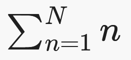

# APL Course - Custom Autumn 2021
Instructional notes and activities to learn Dyalog APL.

!!! Note "Rendering of mathematical notation"
	There is a known issue with the MathJax renderer.  
	If you see some text which looks like:  
	`\(\sum_{n=1}^N n\)`  
	then try refreshing the page. It should look like:  
	

## Version information
This course targets Dyalog version 17.1 Classic, but it is understood that learners will be accessing Dyalog version 12.1 Classic as well. Occasionally there will be version warnings like this:

!!! Warning "Version Warning"
	- The function **where** `⍸⍵` is not available in version 12.1.
	- The glyph/symbol `⍸` is not available in Dyalog Classic, instead it is represented by `⎕U2378`.