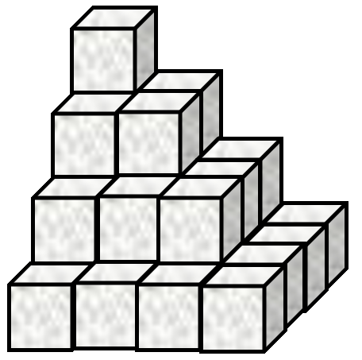
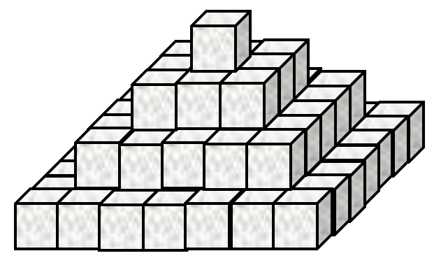
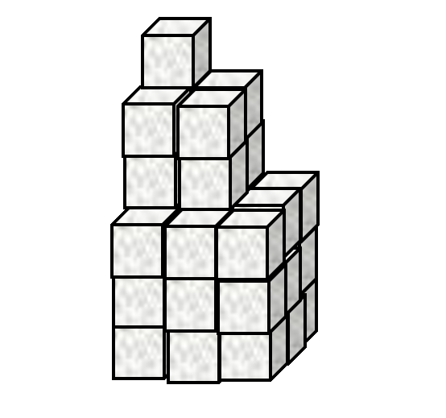

# Part 1

## Expressions
*arithmetic, dfns, order of execution*

1. Without using a computer, evaluate the following expressions. Then, use an APL interpreter to check your answers.
    1. `3×2+4`
    1. `4÷2+6-2`
    1. `3+2 2×2`
    1. `4+2 6×2`
    1. `(3+(6×(2+3)))`
    1. `(3+(6×2)+3)`
    1. `3+6×(2+3)`
    1. `((3+6)×2+3)`
    1. `((3+6)×3)+3`
    1. `((3+6×2)+3)`
    1. `2×7-6+3`
    1. `(2×7)-6+3`

1. The average daily temperatures, in degrees Celcius, for 7 days are stored in a variable `t_allweek`.

    ```APL
	t_allweek ← 11.7 8.6 9.7 14.2 6.7 11.8 9.2
	```
	
    Use APL to compute the follwing:
	
	1. The highest daily temperature
	1. The lowest daily temperature
	1. The range of (difference between the largest and the smallest) temperatures
	1. Each temperature rounded to the nearest whole number

1. Rewrite the following expressions so that they do not use parentheses.
	1. `(÷a)×b`
	1. `(÷a)÷b`
	1. `(a+b)-5`
	1. `(a+b)+5`

## Simple Functions
The following problems can be solved with single-line dfns.

1. Eggs

	A recipe serving 4 people uses 3 eggs. Write the function `Eggs` which computes the number of eggs which need cracking to serve `⍵` people. Using a fraction of an egg requires that a whole egg be cracked.

	```APL
	      Eggs 4
	3

	      Eggs 100
	75

	      Eggs ⍳12
	1 2 3 3 4 5 6 6 7 8 9 9
	```

1. The formula to convert temperature from Celsius ($T_C$) to Fahrenheit ($T_F$) in traditional mathematical notation is as follows:

	$$T_F = {32 + {{9}\over{5}}\times {T_C}}$$  

	Write the function `CtoF` to convert temperatures from Celcius to Farenheit.  
	```APL
	      CtoF 11.3 23 0 16 ¯10 38
	52.34 73.4 32 60.8 14 100.4
	```

## Generating Sequences

1. A Mathematical Notation

	Use APL to evaluate the following

	1. $\prod_{n=1}^{12} n$ (multiply together the first twelve integers)

	1. $\sum_{n=1}^{17}n^2$ (add together the first seventeen squared integers)

	1. $\sum_{n=1}^{100}2n$ (add together the first one hundred positive even integers)

	1. $\sum_{n=1}^{100}2n-1$ (add together the first one hundred odd integers)

	1. In TMN, the following expression is equal to `0`, why does the following return `70` in APL?
		```APL
		      84 - 12 - 1 - 13 - 28 - 9 - 6 - 15  
		70
		```

*[TMN]: Traditional Mathematical Notation

1. Pyramid Schemes
	1. Sugar cubes are stacked in an arrangement as shown by **Figure 1**.

		
			<figcaption><strong>Figure 1.</strong> Stacked sugar cubes</figcaption>

		This stack has `4` **layers** and a total of `30` cubes. How many cubes are there in a similar stack with `467` **layers**?

	1. Now consider the stack in **Figure 2**.

		
			<figcaption><strong>Figure 2.</strong> Differently stacked sugar cubes</figcaption>

		The arrangement in **Figure 2** has `4` **layers** and `84` cubes. How many cubes are there in a similar stack with `812` **layers**?

	1. Now look at **Figure 3**.

		
			<figcaption><strong>Figure 3. </strong>This is just a waste of sugar cubes by now...</figcaption>

		The stack in **Figure 3** has `3` **"layers"** and `36` cubes in total. How many cubes are there in a similar stack with `68` **"layers"**?

1. Write a function `To` which returns integers from `⍺` to `⍵` inclusive.

	```APL
	      3 To 3
	3
	      3 To 4
	3 4
	      1 To 7
	1 2 3 4 5 6 7
	      ¯3 To 5
	¯3 ¯2 ¯1 0 1 2 3 4 5
	```

	**BONUS:** What if `⍺>⍵`?  
	```APL
	      3 To 5
	3 4 5
	      5 To 3
	5 4 3
	      5 To ¯2
	5 4 3 2 1 0 ¯1 ¯2
	```
