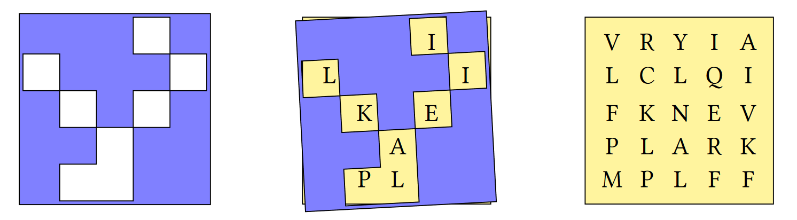

# Part 2

## Spot the Difference
In each of the following scenarios, think:
- What output was intended?
- Why doesn't the written expression product the intended output?
- What would you change to fix the expression?

1. I have 100 sweets in a bowl. I give 10 to James, 13 to Vela, 11 to Malai and 14 to Alex. 31 fall
on the floor and the bowl breaks. How many do I have left?

	```apl
	100 – 10 – 13 – 11 – 14 - 31
	```

1. Find $3+\sqrt[3]{27}$

	```apl
	3 + ÷3*27
	```

1. Find the distance between the points (3,12) and (6,16) in Euclidean space

	```apl
	((16-12)*2 + (6-3)*2)*0.5
	```

1. List the numbers from 13 to 27 inclusive

	```apl
	⍳ 27 - 13
	```

1. Return 1 when X>3 and X≤7

	```apl
	X ← 10
	X > 3 ∧ X ≤ 7
	```

1. Sum the salaries of employees in group G

	```apl
	Grp ← 'AFGFG'
	Sal ← 32000 33500 41000 33900 41500
	+/ Grp='G' / Sal
	```

## Vectors and Matrices
1. Define the numeric vector `nums`
	
	```APL
	nums ← 3 5 8 2 1
	```

	1. Using `nums`, define `mat`

	```APL
	      mat
	```
	```
	3 5 8
	2 1 3
	```

	1. Using `mat`, define `wide`

	```APL
	      wide
	```
	```
	3 5 8 3 5 8
	2 1 3 2 1 3
	```

	1. Using `mat`, define `stack`

	```APL
	      stack
	```
	```
	3 5 8
	3 5 8
	2 1 3
	2 1 3
	```

1. Why does `101='101'` evaluate to a 3-element list?

## Slashes
By hand, evaluate the following expressions:

1. `+/3 1 4`
1. `3/3 1 4`
1. `2 6++/5 2`
1. `2 6+3/5`
1. `2 6+2/5`

## Indexing
1. Write a function `PassFail` which takes an array of scores and returns an array of the same shape in which `F` corresponds to a score less than 40 and `P` corresponds to a score of 40 or more.

	```APL
	      PassFail 35 40 45
	FPP

	      PassFail 2 5⍴89 77 15 49 72 54 25 18 57 53

	PPFPP
	PFFPP
	```

## Analysing Text
1. Analysing text

	1. Write a function test if there are any vowels `'aeiou'` in text vector `⍵`

		```APL
		      AnyVowels 'this text is made of characters'
		1
		      AnyVowels 'bgxkz'
		0
		```

	1. Write a function to count the number of vowels in its character vector argument `⍵`

		```APL
		      CountVowels 'this text is made of characters'
		9

		      CountVowels 'we have twelve vowels in this sentence'
		12
		```

	1. Write a function to remove the vowels from its argument

		```APL
		      RemoveVowels 'this text is made of characters'
		ths txt s md f chrctrs
		```

## APL Quest Problems

### 1: Grille

A Grille is a square sheet with holes cut out of it which, when laid on top of a similarly-sized character matrix, reveals a hidden message.

Write an APL function `Grille` which:
- takes a character matrix left argument where a hash `'#'` represents opaque material and a space `' '` represents a hole.
- takes a character matrix of the same shape as right argument
- returns the hidden message as a character vector
```APL
	  (2 2⍴'# # ') Grille 2 2⍴'LHOI'
HI
	  grid   ← 5 5⍴'VRYIALCLQIFKNEVPLARKMPLFF'
	  grille ← 5 5⍴'⌺⌺⌺ ⌺ ⌺⌺⌺ ⌺ ⌺ ⌺⌺⌺ ⌺⌺⌺  ⌺⌺'
	  grid grille
┌─────┬─────┐
│VRYIA│⌺⌺⌺ ⌺│
│LCLQI│ ⌺⌺⌺ │
│FKNEV│⌺ ⌺ ⌺│
│PLARK│⌺⌺ ⌺⌺│
│MPLFF│⌺  ⌺⌺│
└─────┴─────┘
	  grille Grille grid
ILIKEAPL
```

### 2: Attack of the Mutations!

<p>This problem is inspired by the <a href="https://rosalind.info/problems/hamm/">Counting Point Mutations</a> problem found on the excellent Bioinformatics education website <a href="https://rosalind.info">rosalind.info</a>.</p>
<p>Write a function that:</p>
<ul>
    <li>takes right and left arguments that are character vectors or scalars of equal length – these represent DNA strings.</li>
    <li>returns an integer representing the <a href="https://rosalind.info/glossary/hamming-distance/">Hamming distance</a> (the number of differences in corresponding positions) between the arguments.</li>
</ul>

<p><i class="fas fa-lightbulb-on"></i> <strong>Hint:</strong> The <em>plus</em> function <a href="https://help.dyalog.com/latest/Content/Language/Symbols/Plus.htm" class="APL" target="_blank">X+Y</a> could be helpful.
</p>

<h3>Examples</h3>
<pre class="APL">
      'GAGCCTACTAACGGGAT' (<i>your_function</i>) 'CATCGTAATGACGGCCT' 
7

      'A' (<i>your_function</i>) 'T'
1

      '' (<i>your_function</i>) ''
0
 
      (<i>your_function</i>)⍨ 'CATCGTAATGACGGCCT'
0
</pre>

### 3: Counting DNA Nucleotides?

<i class="fad fa-dna"></i>

<p>This problem was inspired by <a href="https://rosalind.info/problems/dna/">Counting DNA Nucleotides</a> found on the excellent bioinformatics website <a href="https://rosalind.info">rosalind.info</a>.</p>

<p>Write a function that:</p>
<ul>
    <li>takes a right argument that is a character vector or scalar representing a DNA string (whose alphabet contains the symbols 'A', 'C', 'G', and 'T').</li>
    <li>returns a 4-element numeric vector containing the counts of each symbol 'A', 'C', 'G', and 'T' respectively.
    </li>
</ul>

<h3>Examples</h3>
<pre class="APL">      
      (<i>your_function</i>) 'AGCTTTTCATTCTGACTGCAACGGGCAATATGTCTCTGTGTGGATTAAAAAAAGAGTGTCTGATAGCAGC'
20 12 17 21

      (<i>your_function</i>) ''
0 0 0 0

      (<i>your_function</i>) 'G'
0 0 1 0

</pre>

### 4: Making the Grade
<table id="gradeBoundaryTable" style="border-top: none;">
<tbody>
<tr>
<td><strong>Score Range</strong></td>
<td><code>0-64</code></td>
<td><code>65-69</code></td>
<td><code>70-79</code></td>
<td><code>80-89</code></td>
<td><code>90-100</code></td>
</tr>
<tr>
<td><strong>Letter Grade</strong></td>
<td>F</td>
<td>D</td>
<td>C</td>
<td>B</td>
<td>A</td>
</tr>
</tbody>
</table>
   Write a function that, given an array of integer test scores in the inclusive range 0 to 100, returns a list of letter grades according to the table above.
<pre><code class="language-APL">      Grade 0 10 75 78 85</code></pre>
<pre><code class="language-APL">FFCCB</code></pre>
